# aks-design

Design drafts for a large Azure Kubernetes Service (AKS) platform with strong isolation between
**internal / external** workloads and between **countries**, plus application multi-tenancy inside each isolation zone.

The platform runs **two types of clusters** – zonal **stateless** clusters in the frontend network and an
**optional** zone-redundant **stateful** cluster in the Internet-less backend network – in **dev, acc and prd**, i.e. six
clusters (nine with the stateful cluster) kept in sync from one Git repository – the stateless clusters with **FluxCD**, the stateful cluster
with **CI/CD pipelines** – with fully automated zero-downtime upgrades of applications and clusters.
Data belongs in **Azure PaaS services**; the stateful cluster is the *last option*, used only when no suitable PaaS
service exists or a special use case requires it, and it is **not built at all until the first such workload is
approved**. All admission policies are implemented with the AKS-native **Azure Policy add-on** (Gatekeeper managed by AKS).
Pictures 1–7 describe what is *inside* one cluster; pictures 8–14 describe the fleet of clusters and how traffic is
encrypted.

> Status: **draft** for review. Country codes `fi` / `se` and all IP ranges are examples.

## Requirements

| # | Requirement | How the design meets it |
|---|---|---|
| R1 | Control plane in a dedicated network | Private, VNet-integrated API server in its own delegated subnet; admin access only via Private Link from a separate management VNet ([picture 3](#3-control-plane)) |
| R2 | Internal and external workloads isolated | Separate isolation zones `int-*` and `ext-*` |
| R3 | Workloads of different countries isolated | Separate isolation zones per country (`*-fi`, `*-se`, …) |
| R4 | Isolation = Key Vault + network + node pool per type | Every zone has its own Key Vault, subnets (NSG + route table) and nodes – a node auto provisioning `NodePool` in the stateless clusters, AKS node pools in the stateful cluster ([section 4](#4-node-pools)); certificates are the one shared exception, kept in the per-environment platform Key Vault with a role assignment per certificate |
| R5 | Only connectivity mandatory for Kubernetes allowed between zones | Deny-by-default on three layers: NSG, Azure Firewall, Cilium network policy ([picture 5](#5-allowed-and-blocked-flows)) |
| R6 | Applications isolated in namespaces + network policies | Namespace per application, default-deny policies ([picture 7](#7-application-multi-tenancy-inside-a-zone)) |
| R7 | Key Vault multi-tenancy with [Azure RBAC + ABAC](https://learn.microsoft.com/en-us/azure/key-vault/general/rbac-abac) | Per-application workload identity with secret-name-prefix conditions ([picture 6](#6-workload-identity-first-key-vault-secrets-only-when-needed)) |
| R7a | Workload identities wherever possible, secrets only when needed | Per-application workload identity with Entra ID auth to all Azure services, local auth disabled by Azure Policy; Key Vault secrets only for targets without Entra ID ([section 6](#6-workload-identity-first-key-vault-secrets-only-when-needed)) |
| R8 | Two cluster types: stateless and stateful | Stateless clusters in the frontend network, one optional stateful cluster in the backend network, built only when a workload requires it ([picture 8](#8-cluster-types-stateless-and-stateful)) |
| R8a | Stateful cluster is the last option | Placement order stateless cluster → Azure PaaS → stateful cluster; the stateful cluster needs a documented exception ([where does a workload run](#where-does-a-workload-run)) |
| R9 | Stateful cluster exists at most once, in the backend network with the Azure PaaS services, no Internet connectivity at all | Backend spoke with PaaS private endpoints; network isolated AKS (outbound type `none`), no public IPs, Firewall deny-all for backend prefixes |
| R9a | Stateful cluster: VNet-integrated CNI, no Gateway API implementation (and no Ingress), applications handle TLS | Azure CNI (VNet, dynamic pod IP allocation) powered by Cilium; applications are published with internal `LoadBalancer` Services and terminate TLS themselves ([section 13](#13-encryption-in-transit-and-tls)) |
| R9b | Stateless clusters: overlay CNI, no service mesh / mTLS / application TLS, TLS-only Gateway API (no Kubernetes Ingress) | Azure CNI Overlay powered by Cilium, Azure Virtual Network encryption between nodes, Traefik as Gateway API implementation with Let's Encrypt certificates for internal DNS names, distributed through Key Vault, and HTTPS-only listeners ([section 13](#13-encryption-in-transit-and-tls)) |
| R10 | Stateful cluster spread over availability zones and running AKS LTS | Fixed-size node pools per AZ 1/2/3 (no autoscaling), ZRS storage, Premium tier with Long Term Support |
| R11 | Stateless: separate cluster per availability zone (at least two), ≥ 2 copies of every application, scaled on load | `sl-az1`, `sl-az2` (+ optional `sl-az3`) behind a zone-redundant traffic layer; policy-enforced replicas ≥ 2, HPA/KEDA, [node auto provisioning](https://learn.microsoft.com/en-us/azure/aks/node-autoprovision) (NAP) |
| R12 | Fully automated zero-downtime upgrades of applications and clusters | Policy-enforced rollout guardrails, releases one cell at a time with cell affinity, pipeline-driven stateful rollout, drain-and-upgrade per stateless cluster, PDB-guarded per-AZ upgrade of the stateful cluster ([section 11](#11-zero-downtime-application-upgrades), [section 12](#12-zero-downtime-cluster-upgrades)) |
| R12a | Update policy: stateful cluster only when absolutely necessary, stateless clusters at two speeds | Stateful: oldest LTS minor kept until 6 months before its end of LTS support, existing nodes patched instead of replaced where possible. Stateless: `sl-az1` on the second latest minor with patches after 1 week per environment, `sl-az2` one minor behind with 1 month per environment ([update policy](#update-policy)) |
| R13 | dev, acc and prd environments kept in sync | 3 × 2 = 6 clusters (3 × 3 = 9 with the stateful cluster) from the same IaC modules, all in-cluster state from one Git repository: FluxCD in the stateless clusters, CI/CD pipeline in the stateful cluster ([picture 9](#9-environments-six-to-nine-clusters), [picture 10](#10-keeping-clusters-in-sync-flux-for-stateless-pipelines-for-stateful)) |
| R14 | One policy engine | Azure Policy add-on for AKS in every cluster, assigned per environment subscription; the same Azure Policy also governs the Azure resources ([section 14](#14-policy-enforcement-with-the-azure-policy-add-on)) |
| R15 | Certificates distributed through Key Vault, shared by all clusters | One shared **platform Key Vault per environment** (`kv-<env>-platform`) holds all certificates of that environment; a renewal job per environment issues one certificate per zone into it, and all clusters of the environment read it with plain Azure RBAC scoped to the individual certificate ([section 13](#certificates-issued-centrally-distributed-through-the-platform-key-vault)) |
| R16 | Countries can be added online | One address space per zone in every cluster VNet, taken from a per-country prefix; a new country adds address spaces, subnets and NAP `NodePool`s / node pools; existing zones only get new routes and Firewall rules ([VNets and address plan](#vnets-and-address-plan)) |

**Isolation zone** = one *type* = one combination of exposure × country:

| Zone | Exposure | Country | NAP `NodePool` (stateless) | Node pools (stateful) | Key Vault (one per environment) | Subnets |
|---|---|---|---|---|---|---|
| `int-fi` | internal | FI | `intfi` | `intfiz1`–`z3` | `kv-<env>-int-fi` | `snet-int-fi-*` |
| `int-se` | internal | SE | `intse` | `intsez1`–`z3` | `kv-<env>-int-se` | `snet-int-se-*` |
| `ext-fi` | external | FI | `extfi` | `extfiz1`–`z3` | `kv-<env>-ext-fi` | `snet-ext-fi-*` |
| `ext-se` | external | SE | `extse` | `extsez1`–`z3` | `kv-<env>-ext-se` | `snet-ext-se-*` |

Adding a country adds two zones (`int-xx`, `ext-xx`) following the same pattern, online ([adding a country](#adding-a-country-online)).

Next to the zone vaults, every environment has exactly **one shared platform Key Vault**:

| Key Vault | Exists | Holds | Access |
|---|---|---|---|
| `kv-<env>-<zone>` | Once per zone and environment | Application secrets (`<app>-<secret>`) of that zone | RBAC + ABAC per application ([section 6](#6-workload-identity-first-key-vault-secrets-only-when-needed)) |
| `kv-<env>-platform` | Once per environment (`kv-dev-platform`, `kv-acc-platform`, `kv-prd-platform`) | The environment's TLS certificates of all zones (`cert-<zone>-…`) and the renewal job's ACME account key | Plain Azure RBAC, role assignments scoped to single certificates ([section 13](#certificates-issued-centrally-distributed-through-the-platform-key-vault)) |

Colour legend in all pictures: grey = control plane / platform / PaaS, blue = internal, orange = external,
purple = hub / management, green = identity, teal = stateless cluster (cell), pink = stateful cluster,
yellow = notes / policy, red dashed = blocked.

### Cells and bulkheads

The design uses two isolation patterns at two levels, and this document uses their names:

| Term | In this design | Pattern | Limits the impact of |
|---|---|---|---|
| **Cell** | One stateless cluster (`aks-<env>-sl-az<N>`) with its own VNet, all of it in one availability zone, running a full copy of every application of every isolation zone | [Cell-based architecture](https://docs.aws.amazon.com/solutions/cell-based-architecture-for-amazon-eks/) | An availability zone outage, a cluster failure, a bad release or a bad cluster upgrade: changes reach one cell at a time |
| **Cell router** | The traffic layer: Front Door for external zones, NGINXaaS for internal zones; maps each client IP to a cell ([incoming traffic](#incoming-traffic-from-outside-and-from-inside)) | Cell-based architecture | – (zone-redundant, outside the cells) |
| **Isolation zone** | One exposure × country (`int-fi`, `ext-se`, …) with its own address space, subnets, nodes, Key Vault and policies, present in every cell | [Bulkhead](https://learn.microsoft.com/en-us/azure/architecture/patterns/bulkhead) | A noisy, failing or compromised workload of one zone: it cannot use another zone's nodes, network or secrets |
| **Shared tier** | Hub (Firewall, gateways, DNS), Azure PaaS, ACR, Key Vaults, the optional stateful cluster | – | Not split into cells; zone-redundant instead, and changed with extra care |

Two differences from the classic cell-based architecture:

- **Every cell serves every user.** The cells are full replicas, aligned with availability zones (as in the AWS
  guidance for EKS, one cluster per availability zone); users are not partitioned between cells by tenant or
  customer. The cell router only pins a user's *session* to a cell ([cell affinity](#incoming-traffic-from-outside-and-from-inside)).
  Partitioning by country would be possible later, because the isolation zones already are the natural partition key.
- **The data is shared.** All cells use the same PaaS services and stateful cluster, so a cell isolates compute and
  releases, not data. Data changes therefore follow the [compatibility rule](#11-zero-downtime-application-upgrades).

In this document "zone" means an isolation zone, unless it says availability zone (AZ) or zone-redundant.

---

## 1. Overview


Hub-and-spoke landing zone. The **hub** holds the shared connectivity services: Azure Firewall (all egress and
east-west inspection), VPN/ExpressRoute gateway, Private DNS and Bastion. A separate **management VNet** hosts
jump hosts and CI/CD agents and is the only place the Kubernetes API can be reached from.
Each **AKS spoke** contains one cluster split into a control plane zone and four workload isolation zones.
Every cluster of the fleet – stateless or stateful – has this same inner layout; how the clusters are placed in
the frontend and backend networks is shown in [picture 8](#8-cluster-types-stateless-and-stateful).
External zones receive Internet traffic through Azure Front Door Premium (WAF, Private Link to the clusters);
internal zones are reached only from the corporate network through the firewall and an internal NGINXaaS entry point. In both cases the traffic ends at the zone's Traefik gateway
in a stateless cluster – the stateful cluster is never reached from outside the platform.

## 2. Network layout


An Azure VNet can have several non-overlapping **address spaces**, and AKS only requires that a cluster's subnets
are in the same VNet, not in the same address space. The design uses this: the control plane zone and **every
isolation zone get their own `/20` address space** in the spoke VNet, taken from that zone's prefix of the
environment ([address plan](#vnets-and-address-plan)). The zone's subnets for nodes, internal load balancers and
private endpoints live inside that address space. A new zone is added online as a new address space, so the
existing ones never change. Whether the zone also has a pod subnet depends on the cluster type's CNI:

| | Stateful cluster | Stateless clusters |
|---|---|---|
| CNI | Azure CNI, VNet-integrated with dynamic pod IP allocation, powered by Cilium | Azure CNI Overlay, powered by Cilium |
| Pod IPs | From `snet-<zone>-pods` – routable in the VNet, visible to NSGs and the firewall | From a private overlay CIDR outside the VNet (the same CIDR can be reused in every stateless cluster) |
| Pod traffic leaving the cluster | Keeps the pod IP | SNAT to the node IP, so NSGs and the firewall see the zone's `snet-<zone>-nodes` |
| `snet-<zone>-pods` | Yes | Not needed |
| `snet-<zone>-ilb` | Internal load balancers of the applications' `LoadBalancer` Services | Internal load balancer of the zone's Traefik gateway |

Zone isolation works the same with both CNIs because every zone has its own nodes in its own node subnet (a NAP
`NodePool` whose `AKSNodeClass` points at the zone's subnet, or AKS node pools in the stateful cluster): a packet from
a stateless zone always carries an address of that zone's subnets.
Every subnet has its own **NSG** (deny VNet-to-VNet by default) and each zone its own **route table** sending
`0.0.0.0/0` *and the other zones' address spaces* to Azure Firewall, so any cross-zone packet that the NSG would allow
is still inspected and denied by the firewall.

Address spaces are an addressing tool, not an isolation boundary:

- All address spaces of a VNet reach each other through the system routes. A UDR overrides a system route only
  when its prefix is at least as specific, so a zone's route table needs one route **per other zone's address
  space** (a single `10.0.0.0/8 → Firewall` route would lose to the more specific `/20` system routes). Adding a
  zone adds one route to each existing zone's route table, generated by IaC.
- The `VirtualNetwork` service tag covers all address spaces of the VNet, the peered VNets and on-premises. NSG
  *allow* rules therefore use the zone prefixes (or Application Security Groups), never `VirtualNetwork`.

> **Why subnets and not separate VNets?** AKS requires all node pool subnets and the API server subnet of one
> cluster to be in the same VNet. Within one cluster, "network per type" is therefore implemented as
> *address space and subnets per type + NSG + UDR via firewall*. If a hard VNet boundary per country is required
> (e.g. regulatory), switch to **one cluster per zone** – the pictures stay the same except that each zone becomes
> its own spoke, and the address plan stays the same.

## 3. Control plane


The API server uses **API Server VNet Integration**: it is projected as an internal load balancer into a
dedicated, delegated `snet-apiserver` (/28) that contains nothing else. The cluster is **private** (public
endpoint disabled). Admins (Entra ID + PIM, Azure RBAC for Kubernetes) and CI/CD reach it only through a
Private Endpoint / Private Link Service in the management VNet. Nodes talk to the ILB IP directly (no tunnel,
no DNS). The system node pool (tainted `CriticalAddonsOnly`, fixed node count) runs only platform components.

## 4. Node pools


Every isolation zone has its own nodes in that zone's subnets, labelled `platform/zone=<zone>` and tainted
`platform/zone=<zone>:NoSchedule`. How the nodes are created differs per cluster type, because the two cluster types
run different kinds of workloads:

| | Stateless clusters | Stateful cluster |
|---|---|---|
| Zone nodes | [Node auto provisioning](https://learn.microsoft.com/en-us/azure/aks/node-autoprovision) (NAP, AKS-managed Karpenter): one Karpenter `NodePool` + `AKSNodeClass` per zone (`intfi`, `extfi`, …); no classic node pools for workloads | Classic AKS node pools (VM scale sets), one per zone *and* AZ (`intfiz1`, `intfiz2`, `intfiz3`, …) |
| Subnet | `AKSNodeClass` `vnetSubnetID` = the zone's `snet-<zone>-nodes` | `--vnet-subnet-id` `snet-<zone>-nodes`, `--pod-subnet-id` `snet-<zone>-pods` |
| Availability zone | `NodePool` requirement `topology.kubernetes.io/zone In [<region>-<N>]` – the cell's AZ | `--zones 1` / `2` / `3`, one pool per AZ |
| VM sizes | Chosen by NAP for the pending pods from an allow-list of several VNet-encryption-capable SKU families in the `NodePool` requirements | One fixed size per pool, chosen when the workload's exception is onboarded |
| Scaling | Nodes are created for pending pods and removed or consolidated when they are empty or under-used; the `NodePool` `limits` (CPU, memory) are the upper bound, sized for N+1 | **No autoscaling.** Fixed node count per pool, set in IaC; capacity changes are planned changes |
| Node replacement | Drift (new node image or Kubernetes version), consolidation and `expireAfter`, limited by the `NodePool` disruption budgets; PDBs are respected | Surge upgrade per pool, one AZ at a time ([section 12](#stateful-cluster)) |
| Defined by | Flux, in `infrastructure/stateless` (subnet IDs and AZ from the `cluster-vars` ConfigMap), applied before anything that runs on zone nodes | Cluster IaC |
| System pool | Classic node pool `system`, fixed node count, pinned to the cell's AZ | Classic node pool `system`, fixed node count, spread over AZ 1–3 |

**Why two models.** Stateless workloads scale on load all day and can be moved at any time, so NAP fits them: it
picks the VM size from what the pending pods need, packs them tightly and gives unused nodes back, and the platform
does not maintain a node pool per zone × VM size or plan the capacity of a freshly built cell. The stateful cluster
runs a few approved StatefulSets and operators that are sized when they are onboarded and do not scale on load;
every node change moves a replica and re-attaches its disks. Fixed-size node pools keep its capacity predictable,
and its nodes change only in planned upgrades – never because an autoscaler decided to consolidate.

NAP details in the stateless clusters:

- NAP is enabled with `--node-provisioning-mode Auto`; the AKS-created default `NodePool`s are disabled
  (`--node-provisioning-default-pools None`), so every NAP node belongs to a zone's `NodePool`. NAP requires Azure CNI
  Overlay powered by Cilium, which the stateless clusters use anyway. The cluster autoscaler is not used anywhere.
- Several SKU families in each allow-list lower the risk that the cell's single AZ runs out of capacity for one VM size
  when a cell is pre-scaled to carry the full load ([section 12](#stateless-clusters)).
- Disruption budgets keep consolidation slow (e.g. at most 10 % of a zone's nodes at a time) and block it while a cell
  is being changed; all applications have ≥ 2 replicas and a PDB, so consolidation never takes an application down.
- Only the platform manages `NodePool` and `AKSNodeClass` objects (Kubernetes RBAC), and Azure Policy rejects any whose
  subnet, label, taint or VM sizes do not match its zone ([section 14](#14-policy-enforcement-with-the-azure-policy-add-on)).

Application namespaces are named `<zone>-<app>` and carry the matching `platform/zone` label. The Azure Policy
add-on injects the zone's `nodeSelector` and toleration into every pod (one mutation definition per zone, matched by
the namespace prefix `<zone>-*`) and **rejects** pods that try to select or tolerate another zone. The checks use
the namespace *name*, not a lookup of the namespace's labels, because custom Azure Policy definitions cannot use
Gatekeeper data replication; a separate policy makes sure the label of a namespace matches its name prefix. Only platform
DaemonSets (Cilium, CSI drivers, monitoring) run on all nodes.

Note: the kubelet identity is cluster-wide in AKS, so it is **never** granted access to Key Vaults – workloads
use workload identity only (picture 6).

## 5. Allowed and blocked flows


Only the flows Kubernetes needs to function are allowed between a workload zone and the rest of the platform:

| # | Source | Destination | Port | Purpose |
|---|---|---|---|---|
| ① | Zone nodes | `snet-apiserver` | TCP 443, 4443 | kubelet / pods → API server |
| ② | `snet-apiserver` | Zone nodes | TCP 10250 | logs, exec, port-forward |
| ③ | Zone pods | CoreDNS (system pods) | UDP/TCP 53 | name resolution |
| ④ | metrics-server (system pods) | Zone nodes | TCP 10250 | resource metrics |
| ⑤ | Zone pods | Own zone Key Vault PE | TCP 443 | secrets (only applications that need one) |
| ⑤b | Zone pods that need a certificate (Traefik, TLS-terminating apps) | Platform Key Vault PE in `snet-platform-pe` | TCP 443 | certificates; Cilium policy allows only these pods, RBAC only their zone's certificates |
| ⑥ | Zone nodes + pods | Azure Firewall | per FQDN | AKS required FQDNs, MCR, Entra ID (workload identity token exchange), Azure Monitor |
| ⑦ | Zone nodes | All nodes | TCP 4240, ICMP | Cilium health (optional) |
| – | AzureLoadBalancer | `snet-apiserver` | TCP 9988 | API server health probe |

**Everything else between zones is blocked** – pod-to-pod, pod-to-other-zone Key Vault and direct Internet –
enforced three times: NSG (L3/L4), Azure Firewall (L3–L7, logged), Cilium cluster-wide policy (pod identity).

## 6. Workload identity first, Key Vault secrets only when needed


**Rule: an application authenticates with its workload identity wherever the target supports Microsoft Entra ID;
a secret is used only when there is no other way.** No passwords, connection strings with keys, SAS tokens or
storage account keys for Azure services.

### Workload identity per application

- Each application has, per isolation zone and environment, its own user-assigned managed identity
  (`id-<zone>-<app>`), created by IaC together with the namespace. Its Kubernetes ServiceAccount carries the
  `azure.workload.identity/client-id` annotation; pods get a short-lived projected token that is exchanged for an
  Entra ID token – nothing long-lived is stored anywhere.
- **Federated credentials per cluster**: every cluster has its own OIDC issuer, so the identity has one federated
  credential per cluster of the environment (`sl-az1`, `sl-az2`, (`sl-az3`), `sf`) for subject
  `system:serviceaccount:<namespace>:<app>`. A rebuilt stateless cluster gets a new issuer; the IaC that creates the
  cluster also updates the federated credentials (a managed identity allows at most 20).
- The identity gets **data-plane roles directly on the Azure resources of its zone**, never on other zones:

| Target | How the application authenticates | Local auth disabled with |
|---|---|---|
| Azure SQL Database | Entra token (`Active Directory Default` in the driver), contained database user for the identity | Entra-only authentication |
| Azure Database for PostgreSQL | Entra token as password, role mapped to the identity | Entra-only authentication |
| Storage (Blob, Queue, Table, Files REST) | `Storage Blob Data …` roles | `allowSharedKeyAccess: false` |
| Service Bus, Event Hubs | `… Data Sender / Receiver` roles | `disableLocalAuth: true` |
| Cosmos DB | Cosmos DB data-plane RBAC | `disableLocalAuth: true` |
| Azure Cache for Redis | Entra authentication, access policy for the identity | access keys disabled |
| Key Vault (only for the secrets below) | `Key Vault Secrets User` with ABAC condition | RBAC permission model |
| Other Azure APIs (App Configuration, Azure OpenAI, …) | Azure RBAC roles | `disableLocalAuth` where available |

  "Local auth disabled" is enforced with Azure Policy on the resources, so a key-based fallback cannot be switched
  on later. Application configuration contains only endpoints and client IDs, which are not secrets.
- **Platform components use workload identity too**: Flux (`OCIRepository` `provider: azure`), the stateful
  deployment pipeline (workload identity federation, no client secret), Traefik's certificate
  mount (Secrets Store CSI driver), the Azure Monitor agent, external-dns. Images are pulled
  with the kubelet identity, which has only `AcrPull` on the environment's ACR – no `imagePullSecrets`.

### Secrets only when needed

A secret is allowed only when the target cannot use Entra ID: third-party APIs and SaaS keys, partner systems and
legacy protocols. TLS certificates are **not** in the zone vaults; they live in the environment's platform Key Vault
([section 13](#certificates-issued-centrally-distributed-through-the-platform-key-vault)).
Such a secret always lives in the zone's **Key Vault** – never in Git, Helm values or a Kubernetes `Secret` created by
hand.

Each zone has its **own Key Vault per environment** (`kv-<env>-<zone>`, RBAC permission model, public access
disabled), shared by all clusters of the environment, with a private endpoint in the zone's `snet-<zone>-pe` of every
cluster spoke. Inside a zone's vault, applications share the vault but are separated with
[Azure ABAC conditions](https://learn.microsoft.com/en-us/azure/key-vault/general/rbac-abac):

- The application's workload identity gets **Key Vault Secrets User** on the zone vault with condition
  `@Resource[Microsoft.KeyVault/vaults/secrets:name] StringStartsWith '<app>-'`.
- Application pipelines get **Key Vault Secrets Officer** with the same prefix on
  `@Request[...secrets:name]` for `setSecret`; rotation is owned by the application team (expiry dates set, Event
  Grid `SecretNearExpiry` alerts).
- Secrets are mounted as **files** with the Secrets Store CSI driver; syncing them into Kubernetes `Secret` objects
  (`secretObjects`) is rejected by policy (only the TLS certificate in `<zone>-gateway` is synced, for Traefik), as
  are hand-made `Opaque` Secrets in application namespaces
  ([section 14](#14-policy-enforcement-with-the-azure-policy-add-on)).

Constraints to keep in mind: Key Vault ABAC is **preview**, supports **secrets only** (not keys/certificates
operations) and only **vault name + secret name** attributes, and lowercase values. Therefore the secret naming
convention `<app>-<secret>` is mandatory and must be enforced by the platform. A name condition on
`readMetadata` breaks list calls – gate `getSecret` instead. Because most applications need no secrets at all, the
vault stays small and the preview dependency affects only the few exceptions.

## 7. Application multi-tenancy inside a zone


Each application gets its own namespace(s) inside a zone, with a baseline policy set applied automatically:

1. default deny for inbound and outbound traffic;
2. allow DNS to CoreDNS in `kube-system`;
3. allow inbound traffic only from the zone's Traefik gateway namespace (stateless clusters) or, in the stateful cluster,
   only from the node subnets of the same zone in the stateless clusters (Cilium CIDR policy; the applications'
   `LoadBalancer` Services use `externalTrafficPolicy: Local` so the client IP is preserved);
4. allow traffic within the namespace;
5. allow egress only to the zone Key Vault private endpoint, the platform Key Vault private endpoint (only pods that
   need a certificate) and approved FQDNs (via firewall).

Applications in the same zone therefore cannot talk to each other unless an explicit policy pair is agreed.
Kubernetes RBAC is namespace-scoped (Entra ID groups per application team), plus ResourceQuota/LimitRange per
namespace.


## 8. Cluster types: stateless and stateful


Every environment has two kinds of clusters. The split follows one rule: **a cluster that holds no data can be
taken out of traffic, upgraded or even rebuilt at any time; a cluster that holds data cannot, so it is made
zone-redundant and changed as rarely as possible.**

### Where does a workload run

Data does not belong in Kubernetes by default. Every workload is placed by going down this list and stopping at the
first option that fits:

1. **Stateless cluster** – all application code. Its state lives in the options below.
2. **Azure PaaS service in the backend network** (Azure SQL / PostgreSQL, Storage, Service Bus, Event Hubs, Cosmos DB,
   Cache for Redis, …) reached through private endpoints from the stateless clusters. Zone redundancy, backups,
   patching and upgrades are Microsoft's job.
3. **Stateful cluster – last option**, only when
   - no Azure PaaS service provides the capability (e.g. a product that is only shipped as a container or operator), or
   - a special use case requires it (e.g. a licence, a latency requirement to data that only the cluster can meet,
     a protocol the PaaS service does not offer).

A workload in the stateful cluster needs a documented exception (why 1 and 2 do not fit, owner, exit plan) approved by
the platform team, and the stateful cluster itself is only built when the first exception is approved
([optional](#9-environments-six-to-nine-clusters)); the exception is the label `platform/stateful-exception=<ticket>` on its namespace, required by a
policy. The exceptions are reviewed when new PaaS services become available. The fewer workloads the
stateful cluster runs, the smaller its blast radius and upgrade risk.

### Comparison

| | Stateless (`aks-<env>-sl-az<N>`) | Stateful (`aks-<env>-sf`) |
|---|---|---|
| Runs | Frontends, APIs, workers – anything that can be killed and recreated; state in Azure PaaS | Only approved exceptions: workloads that own data on disks (StatefulSets, operators) for which no PaaS service fits |
| Count per environment | One per availability zone: `sl-az1`, `sl-az2` mandatory, `sl-az3` optional (recommended for prd) | Zero or one – built only when the first approved workload needs it |
| Availability zones | All nodes of a cluster in its AZ (system pool `--zones <N>`, NAP `NodePool`s by zone requirement); the cluster is the unit of failure | Every isolation zone has one node pool per AZ (`intfiz1`, `intfiz2`, `intfiz3`, …); system pool spread over AZ 1–3 |
| Nodes | [Node auto provisioning](https://learn.microsoft.com/en-us/azure/aks/node-autoprovision): one Karpenter `NodePool` per isolation zone, VM size chosen per workload ([section 4](#4-node-pools)) | Classic AKS node pools with a fixed VM size and node count |
| Network | Frontend spoke `vnet-<env>-sl-az<N>`, peered to the hub | Backend spoke `vnet-<env>-sf`, peered to the hub, together with the PaaS private endpoints |
| Internet | Egress only via Azure Firewall FQDN allow-list (outbound type `userDefinedRouting`); inbound only via the traffic layer | **None.** [Network isolated cluster](https://learn.microsoft.com/en-us/azure/aks/concepts-network-isolated) (outbound type `none`, bootstrap artifacts from the private ACR cache), no public IPs, UDR `0.0.0.0/0` → Firewall which denies all Internet for backend prefixes |
| CNI | [Azure CNI Overlay](https://learn.microsoft.com/en-us/azure/aks/concepts-network-azure-cni-overlay) powered by Cilium | Azure CNI (VNet-integrated, dynamic pod IP allocation) powered by Cilium |
| Incoming HTTP(S) | [Gateway API](https://gateway-api.sigs.k8s.io/) with Traefik as the implementation, one `Gateway` per isolation zone, HTTPS only; the Kubernetes Ingress API is not used | **No Gateway API implementation and no Ingress.** Applications are published with internal `LoadBalancer` Services (L4) |
| TLS | Terminated by Traefik with Let's Encrypt certificates for internal DNS names; applications serve plain HTTP inside the cluster | **Terminated by the application itself** – a hard onboarding requirement |
| Node-to-node encryption | [Azure Virtual Network encryption](https://learn.microsoft.com/en-us/azure/virtual-network/virtual-network-encryption-overview) – no service mesh, no mTLS | Application TLS (VNet encryption may be enabled as defence in depth but is not relied on) |
| Kubernetes version | Standard support, two speeds: `sl-az1` on the second latest GA minor (N-1), `sl-az2` (and `sl-az3`) one minor behind (N-2) ([update policy](#update-policy)) | [Long Term Support](https://learn.microsoft.com/en-us/azure/aks/long-term-support) (`--tier premium --k8s-support-plan AKSLongTermSupport`), kept on the same minor until 6 months before its LTS ends |
| Tier | Standard | Premium (required for LTS) |
| Scaling | ≥ 2 replicas per app, HPA / KEDA on load, NAP adds and removes nodes; **each cluster sized to carry 100 % of the load alone** (NAP `NodePool` limits) | ≥ 3 replicas per StatefulSet, one per AZ; **no autoscaling** – fixed node count per pool, sized when an exception is onboarded and changed as a planned IaC change |
| Storage | None – admission policy rejects PersistentVolumeClaims; ephemeral OS disks | Azure Disk `Premium_ZRS` / `StandardSSD_ZRS`, Azure Files ZRS; prefer PaaS for databases |
| Upgrade model | Drain from traffic, upgrade or rebuild, return ([picture 11](#stateless-clusters)) | In place, one AZ at a time, PDB-protected ([picture 12](#stateful-cluster)) |

**Isolation zones are kept in both cluster types.** Each stateless and the stateful cluster have the nodes,
subnets, Key Vaults and policies of zones `int-fi`, `int-se`, `ext-fi`, `ext-se` exactly as in pictures 2–7 – the data
in the stateful cluster is what needs the country separation most. The stateful cluster has no Gateway API (and no Ingress) at all: each
zone's applications are reachable only on their own internal load balancer IPs, and only from the same zone of the
stateless clusters.

### Incoming traffic: from outside and from inside

All requests to applications enter through a **traffic layer** (the cell router) that lives outside the cells, so it
survives every cluster upgrade or rebuild. It has one entry point per isolation zone, and every entry point has the
zone's Traefik gateway of **every** cell as its backends, always over HTTPS (port 443 only). Clients never connect to a
cell directly. The stateful cluster is never a backend of the traffic layer.

| Source | Entry point | Path to the cells |
|---|---|---|
| Internet (external zones `ext-*`) | **Azure Front Door Premium** with a WAF policy per zone; public DNS name of the application → Front Door endpoint | Private Link origins: a Private Link Service on the Traefik internal load balancer of the zone in each cell. No public IP in any spoke |
| Corporate network (internal zones `int-*`) | **[F5 NGINXaaS for Azure](https://docs.nginx.com/nginxaas/azure/)** (managed NGINX Plus) with NGINX App Protect WAF, one deployment per zone, private IP only, in the edge VNet `vnet-<env>-edge`; the name `*.int-fi.prd.example.com` resolves to it in the hub Private DNS | On-premises → ExpressRoute/VPN → hub Firewall → NGINXaaS → hub Firewall → Traefik internal load balancer of the zone in each cell |
| Other Azure workloads (other spokes) | Same internal entry point as the corporate network | Same as above; a Firewall rule per source |
| Applications in the same zone and cell | Kubernetes Service (`<app>.<zone>-<app>.svc`) | Stays inside the cell and its availability zone; never goes through the traffic layer or to another cell |
| Applications in another zone | Not allowed (R5). If a business flow needs it, the caller is treated like any other client: it goes through the target zone's entry point and needs an explicit Firewall rule | – |

**Recommendation: active-active cells with client-IP affinity.** All cells carry traffic all the time, and every
client is mapped to one cell **by its IP address**, so it keeps using the same cell across requests, TLS sessions
and reconnects – also clients that do not support cookies (API clients, mobile apps, other systems):

- **The client's TLS session ends at the traffic layer**, not in a cell. Front Door and NGINX terminate the client's
  TLS (and run the WAF), then open their own TLS connections to the Traefik gateways and choose the cell **per HTTP
  request**. TLS therefore does not keep a client on one cell; the client-IP mapping does.
- **The affinity exists for consistent versions, not for state.** Cells hold no session state: sessions and caches
  belong in Azure PaaS (e.g. Azure Cache for Redis) or in the token, so a client can be moved to another cell at any
  time without losing anything. Affinity only makes sure that a client sees **one application version at a time**
  while a release moves through the cells one by one ([releases cell by cell](#releases-cell-by-cell)).
- **Why not cookies:** cookie affinity (the only affinity Front Door and Application Gateway offer built in) works
  only for clients that keep cookies, and some clients will not.
- **A failed or drained cell moves its clients** to another cell, and they come back when it returns. The mapping is
  deterministic, so every request of a client lands on the same cell again.
- **All cells always prove that they work.** A cluster that only receives traffic in a failure is a cold standby
  with cold caches and untested capacity. With active-active, a cell failure only affects the clients of that cell
  (half or a third).
- **Long-lived connections** (WebSockets, Server-Sent Events, gRPC streaming) stay on one cell for the life of the
  connection. Applications that use them must reconnect with back-off, because draining a cell closes them after the
  drain timeout.

How the client IP is mapped to a cell:

| | Front Door (external) | NGINXaaS (internal) |
|---|---|---|
| Mapping | Rule set per zone: the IPv4 and IPv6 address space is split into blocks (e.g. 16 per family), and each block is assigned to a cell with a rule *socket address in &lt;blocks&gt; → route configuration override: origin group of that cell*. Blocks are assigned by measured traffic so that the cells get similar load | `hash $client_prefix consistent` over the cells' Traefik IPs, where `$client_prefix` is the client's `/24` (IPv4) or `/64` (IPv6), so that a client whose address changes within its network stays in its cell |
| Client IP used | *Socket address* (the address that connected to Front Door), not `X-Forwarded-For`, which a client could forge | `$remote_addr`. The hub Firewall must not SNAT this flow: it is allowed with network rules (no SNAT to private destinations); application rules would SNAT |
| Origins / backends | One origin group per cell and zone: the cell's own origin at priority 1, the other cells at priorities 2 and 3 in the fixed order `az1` → `az2` → `az3`, so the clients of a failed cell all move to the same cell | One upstream per zone with all cells |
| Health probe | HTTPS `GET` to the zone's Traefik health route, which answers only when Traefik and its routes are ready | Same, as an NGINX Plus active health check |
| Take a cell out | Disable the cell's origin: its clients go to the next cell of their origin group | Mark the cell's server `down` in the configuration: consistent hashing moves only that cell's clients; existing connections finish within `worker_shutdown_timeout` (e.g. 300 s) |
| Return a cell | Enable the origin; in steps if wanted, by re-mapping the cell's blocks back a quarter at a time | Remove `down`: the cell gets back exactly the clients it had before |

Limits of client-IP affinity, accepted in this design:

- **NAT**: all users behind one address (a corporate proxy, a carrier-grade NAT) land on the same cell, so the load
  is less even than with cookies. The cells are sized N+1 anyway; the Front Door block assignment is rebalanced from
  the access logs when needed (outside releases, because it moves clients).
- **Changing addresses**: a mobile client that switches networks may change cells. During a release it can then see
  the other version, which the [compatibility rule](#11-zero-downtime-application-upgrades) covers.
- **Real client IP for the applications**: the cells see the traffic layer's addresses; the client IP is in
  `X-Forwarded-For`, which Traefik accepts only from the traffic layer's addresses (`forwardedHeaders.trustedIPs`).

Every Traefik gateway also answers to a **per-cell test host name** (e.g. `*.sl-az1.int-fi.prd.example.com`),
published through the zone's entry point to that cell only: an NGINX `server` block with the cell as the only
backend, or a Front Door route to the cell's origin group whose WAF policy admits only the pipeline's egress IPs. The
release and upgrade pipelines run their smoke and synthetic tests through the real WAF and TLS path before the cell
gets user traffic back ([releases](#releases-cell-by-cell), [section 12](#stateless-clusters)).

The NGINXaaS deployments live in a separate **edge VNet** per environment (`vnet-<env>-edge`), peered to the hub. Each
internal zone's deployment is in its own delegated subnet inside the zone's address space
([address plan](#vnets-and-address-plan)), so the Firewall rule "edge `int-fi` → cells `int-fi`" is again expressed
with zone prefixes, and a UDR sends the cell prefixes → Firewall. External zones need no subnet there, because Front
Door is a global service that reaches the cells through Private Link: the Traefik `Service` in `<zone>-gateway`
creates the Private Link Service itself (`service.beta.kubernetes.io/azure-pls-create: "true"`), and the NSG of
`snet-ext-<country>-ilb` allows TCP 443 only from the Private Link Service's NAT IPs. This traffic does not pass the hub
Firewall; the Front Door WAF and Traefik are its controls.

### VNets and address plan

**Recommendation: one spoke VNet per cluster, with one address space per isolation zone.** The prefixes are
planned **per zone, not per cluster**, so that one prefix still describes a whole zone across all clusters of an
environment.

Why not one common VNet?

| | One VNet per cluster (recommended) | One VNet per environment | One frontend VNet for all stateless clusters + backend VNet |
|---|---|---|---|
| Frontend/backend separation (R9) | Separate VNets, only reachable through the hub Firewall | Lost – the Internet-less backend shares a VNet with the frontend, separated only by NSG/UDR | Kept |
| Change one cluster at a time (R12) | Yes – a VNet change (address space, DNS servers, VNet encryption, peering) affects one cluster, and a stateless cluster can be rebuilt with a fresh VNet | No – every VNet change hits all clusters at once | No for the stateless clusters – a VNet change hits all of them at once |
| VNet settings per cluster type | VNet encryption on the stateless VNets only, other DNS/egress settings for the backend | One setting for all | Yes |
| One prefix per zone | Yes – from the address plan below | Yes | Yes |
| Extra cost | 3–4 hub peerings per environment (plus the edge VNet, needed in every option); the address space of a new zone is added in each cluster VNet (an IaC loop) | – | – |

The usual reason to share a VNet – one summarisable prefix per zone – is achieved by the address plan instead, so
the separate VNets cost almost nothing. The only real cost is that each new zone is added to 3–4 VNets instead of 1.

**Address plan (example).** Every environment gets a `/12`, every country a `/16` of it, and every isolation zone
a `/17` (internal first half, external second half). Inside a zone's `/17` the frontend (stateless clusters and the
zone's internal entry point) uses the first `/18` and the stateful cluster the second `/18`, one `/20` each. That `/20` is added as an address space
to the cluster's VNet, and inside it the subnet layout of [picture 2](#2-network-layout) is reused. The platform
`/16` holds the control plane zone of every cluster in the same way.

| Prefix | dev `10.16.0.0/12` | acc `10.32.0.0/12` | prd `10.48.0.0/12` |
|---|---|---|---|
| Platform (control plane zones) | `10.16.0.0/16` | `10.32.0.0/16` | `10.48.0.0/16` |
| Country `fi` | `10.17.0.0/16` | `10.33.0.0/16` | `10.49.0.0/16` |
| Country `se` | `10.18.0.0/16` | `10.34.0.0/16` | `10.50.0.0/16` |
| Next country | `10.19.0.0/16` | `10.35.0.0/16` | `10.51.0.0/16` |

Layout of one zone, prd `int-fi` `10.49.0.0/17` (`ext-fi` is the same from `10.49.128.0/17`):

| `/20` | Use | Address space of VNet |
|---|---|---|
| `10.49.0.0/20` | `int-fi` in `sl-az1` | `vnet-prd-sl-az1` |
| `10.49.16.0/20` | `int-fi` in `sl-az2` | `vnet-prd-sl-az2` |
| `10.49.32.0/20` | `int-fi` in `sl-az3` (optional) | `vnet-prd-sl-az3` |
| `10.49.48.0/20` | `int-fi` internal entry point, NGINXaaS ([incoming traffic](#incoming-traffic-from-outside-and-from-inside)); unused in external zones | `vnet-prd-edge` |
| `10.49.64.0/20` | `int-fi` in the stateful cluster | `vnet-prd-sf` |
| `10.49.80.0/20` – `10.49.112.0/20` | Reserve: more pod IPs for the stateful cluster (added as another address space) | `vnet-prd-sf` |

A stateless cluster that is rebuilt with a fresh VNet reuses its own `/20`s: it is drained first, so the old cluster
and VNet are deleted before the new ones are created (the other clusters carry the load, N+1). In dev and acc, which
have no `sl-az3`, that slot can host a side-by-side rebuild instead.

So `vnet-prd-sl-az1` has the address spaces `10.48.0.0/20` (control plane), `10.49.0.0/20` (`int-fi`),
`10.49.128.0/20` (`ext-fi`), `10.50.0.0/20` (`int-se`) and `10.50.128.0/20` (`ext-se`). The prefixes summarise in
the way the rules are written:

| Rule scope | prd prefix |
|---|---|
| Everything in the environment | `10.48.0.0/12` |
| Country `fi` (both zones) | `10.49.0.0/16` |
| Zone `int-fi`, all clusters | `10.49.0.0/17` |
| Zone `int-fi`, frontend (cells and the zone's internal entry point) | `10.49.0.0/18` |
| Zone `int-fi`, stateful cluster (backend) | `10.49.64.0/18` |

The rule "stateless zone *X* → stateful zone *X*" is therefore one Firewall rule per zone (`10.49.0.0/18 →
10.49.64.0/18`), and it does not change when a stateless cluster is added or rebuilt. The stateful `/18` is reserved even
while an environment has no stateful cluster. The `/20` per zone and
cluster is generous for the stateless clusters (nodes only); it is sized for the stateful cluster's pod subnets.
If the corporate network cannot spare three `/12`s, the same structure works one level smaller (`/17` per
country). The AKS service CIDR and the overlay pod CIDR of the stateless clusters must stay outside all of these
prefixes and outside the on-premises ranges.

### Adding a country online

A new country is two new zones. It is added cluster by cluster in the order
dev → acc → prd, and the existing zones only get new routes and Firewall rules:

1. **Allocate** the country's next `/16` per environment from the address plan (kept in IaC, or in an Azure
   Virtual Network Manager IP address pool).
2. **Address spaces:** add the zones' `/20`s to each cluster VNet (and the internal zone's edge `/20` to the edge
   VNet) and sync the hub peering
   (`az network vnet peering sync`). Both are online operations; the new prefixes are then advertised to
   on-premises through the hub gateway automatically.
3. **Subnets, NSGs, route tables** for the new zones; add a route for each new address space to the existing zones'
   route tables (and the reverse). Give the cluster identity *Network Contributor* on the new subnets.
4. **Firewall and on-premises:** new rules for the new zone prefixes (IP groups); the existing rules do not change.
5. **Environment module:** zone Key Vaults, private endpoints, managed identities, certificate in the platform Key Vault.
6. **Nodes:** in the stateless clusters, NAP `NodePool`s and `AKSNodeClass`es `intxx` / `extxx` for the new subnets
   (Flux, with the new subnet IDs in `cluster-vars`); in the stateful cluster, node pools `intxxz1`–`z3` /
   `extxxz1`–`z3` (`--vnet-subnet-id`, `--pod-subnet-id`, fixed node count). Neither restarts existing nodes.
7. **Policies and Git:** the zone's Azure Policy mutation and validation, Traefik gateway and namespaces through
   Flux and the stateful pipeline.
8. **Traffic layer:** the internal zone's NGINXaaS deployment in the edge VNet and the external zone's WAF policy,
   origin groups, Private Link origins and IP-block rule set in Front Door; approve the Private Link connections. Existing zones' entry
   points do not change.

In the backend spoke each isolation zone's `snet-<zone>-pe` also holds the private endpoints of that zone's PaaS
services (SQL, Storage, Service Bus, …); a shared `snet-shared-pe` holds the ACR private endpoint used by all clusters
of the environment. With the overlay CNI the stateless spokes have no pod subnets; their node subnets are sized for
the full load of the environment (N+1). Only the stateful spoke has pod subnets.

### Flows between frontend and backend

| Source | Destination | Port | Rule |
|---|---|---|---|
| Stateless zone *X* nodes (pod traffic SNATed by the overlay) | Stateful zone *X* application internal LBs | Application TLS port (e.g. TCP 443) | Same isolation zone only (`int-fi` → `int-fi`), via Firewall; TLS terminated by the application |
| Stateless zone *X* nodes (pod traffic SNATed by the overlay) | Zone *X* PaaS private endpoints | TCP 443, 1433, 5432, 5671 | Same isolation zone only, via Firewall; TLS enforced by the PaaS service |
| All nodes of the environment | ACR private endpoint | TCP 443 | Images, Helm charts, Flux OCI artifacts |
| Stateful cluster | Frontend networks | – | **Blocked** – the backend never initiates connections to the frontend |
| Stateful cluster | Internet | – | **Blocked** – no route, no outbound IP, Firewall deny-all |
| Management VNet pipeline agents | Stateful API server (Private Link) | TCP 443 | Deployments to the stateful cluster ([section 10](#10-keeping-clusters-in-sync-flux-for-stateless-pipelines-for-stateful)) |
| Stateful nodes / pods | Microsoft Entra ID (`AzureActiveDirectory` service tag) | TCP 443 | Exception, needed for workload identity token exchange because Entra ID has no Private Link for sign-in – see open questions |
| Stateful nodes (Azure Policy add-on) | `data.policy.core.windows.net`, `store.policy.core.windows.net`, `dc.services.visualstudio.com` | TCP 443 | Exception, Firewall application rules for these FQDNs only; the add-on has no Private Link ([section 14](#14-policy-enforcement-with-the-azure-policy-add-on)) |

Azure Monitor is reached through an Azure Monitor Private Link Scope. Other AKS add-ons that need public Azure
endpoints are not enabled in the stateful cluster; the Azure Policy add-on is the one accepted exception ([section 14](#14-policy-enforcement-with-the-azure-policy-add-on)).

## 9. Environments (six to nine clusters)


| Environment | Subscription | Stateless | Stateful | Clusters |
|---|---|---|---|---|
| dev | `sub-aks-dev` | `aks-dev-sl-az1`, `aks-dev-sl-az2` | (`aks-dev-sf`) | 2 (3) |
| acc | `sub-aks-acc` | `aks-acc-sl-az1`, `aks-acc-sl-az2` | (`aks-acc-sf`) | 2 (3) |
| prd | `sub-aks-prd` | `aks-prd-sl-az1`, `aks-prd-sl-az2` (+ `aks-prd-sl-az3`) | (`aks-prd-sf`) | 2–3 (3–4) |

**Minimum 6 clusters**, 9 with the stateful cluster; one more per environment that gets a third stateless cluster.
dev and acc must have the *same topology* as prd (at least two stateless clusters, and a three-AZ stateful cluster if
prd has one), otherwise the upgrade procedures cannot be rehearsed there; they can use lower NAP `NodePool` limits and
smaller stateful node pools.

> **The stateful cluster is optional.** It is not built until the first workload has an approved stateful-cluster
> exception ([where does a workload run](#where-does-a-workload-run)); until then every environment runs only the stateless
> clusters and Azure PaaS. The backend network itself exists from day one, because it holds the PaaS private endpoints
> and the ACR. Everything the stateful cluster needs later is already prepared, so adding it is an ordinary IaC change
> with no impact on the running platform: its `/18` per zone is reserved in the address plan, the stateful cluster
> module and pipeline are kept in the repository, and the Firewall rules for "stateless zone *X* → stateful zone *X*"
> are only created with it. The same exception review also lets the platform team remove the stateful cluster again
> when its last workload moves to a PaaS service.

- **Clusters are cattle, built by IaC.** An environment module creates what all clusters of an environment share
  and what must survive a cluster rebuild: the Key Vaults per zone (with the application secrets), the platform Key
  Vault (with the environment's certificates and their role assignments), the application managed identities, the
  ACR and the Azure Policy assignments. Two cluster modules (stateless, stateful) with `env` and `az` as parameters
  create the VNet, cluster, system pool (and, in the stateful cluster, the zone node pools), private endpoints to the shared zone and platform Key Vaults, the federated
  credentials and – in stateless clusters – the Flux bootstrap. The IaC also writes a
  `cluster-vars` ConfigMap (`ENV`, `CLUSTER_TYPE`, `AZ`, `CLUSTER_NAME`, the zones' node subnet IDs) that Flux uses for substitutions (the
  stateful pipeline sets the same variables itself).
- **Versions are the one intended difference.** Environments and cells run the same configuration but not always the
  same Kubernetes version or node image: patches move through dev → acc → prd with a delay, and `sl-az1` and `sl-az2`
  run different minors by design ([update policy](#update-policy)).
- **Everything inside a cluster comes from Git** – via Flux in the stateless clusters and via the deployment pipeline
  in the stateful cluster; no manual `kubectl apply`. Human access in acc and prd is read-only Kubernetes RBAC plus
  break-glass via PIM.
- **Every environment has its own ACR** (in its backend spoke); the promotion pipeline imports the exact image
  digests from the previous environment's ACR (`az acr import`), so prd never pulls from the Internet.

## 10. Keeping clusters in sync: Flux for stateless, pipelines for stateful


One **fleet repository** describes all clusters. Shared content lives once in `base`; cluster type and environment
differences are Kustomize overlays. Both delivery mechanisms deploy the **same signed artifact** built from it:

```text
fleet/
├── clusters/                      # entry point of each stateless cluster (Flux Kustomizations only)
│   ├── dev/{sl-az1,sl-az2}/
│   ├── acc/{sl-az1,sl-az2}/
│   └── prd/{sl-az1,sl-az2,sl-az3}/
├── infrastructure/
│   ├── base/                      # Cilium policies, Secrets Store CSI settings, monitoring
│   ├── stateless/                 # NAP NodePool + AKSNodeClass per zone, Traefik + Gateways + certificate SecretProviderClass per zone, KEDA
│   └── stateful/                  # storage classes (ZRS), operators (no Gateway API) – applied by the pipeline
└── apps/
    └── <app>/
        ├── base/
        ├── stateless/{dev,acc,prd}/   # image digests + replicas/HPA per environment – Flux
        └── stateful/{dev,acc,prd}/    # applied by the pipeline
```

**Why two mechanisms.** The stateless clusters are many, identical and rebuilt often: a pull-based reconcile loop
brings a fresh cluster to the desired state without anyone pushing to it, and corrects drift continuously. The
stateful cluster is a single, long-lived cluster whose changes must be **ordered, gated and observed** (StatefulSet
rollouts, operator upgrades, schema steps) – a pipeline with explicit stages, approvals and a visible run history fits
better, and the Internet-less cluster runs one component less.

**Common: build and publish**

- **Policies are not in the fleet repository**: they are Azure Policy definitions and assignments in the IaC
  repository ([section 14](#14-policy-enforcement-with-the-azure-policy-add-on)); CI still tests the rendered fleet
  manifests against the same constraint templates.
- **Artifact = OCI artifact in the environment's ACR.** On merge to `main`, CI validates (`kustomize build`,
  kubeconform against every Kubernetes minor that runs in the fleet – both stateless speeds and the stateful LTS
  version, see [update policy](#update-policy) – and policy tests), runs `flux push artifact oci://<acr>.azurecr.io/fleet:<git-sha>`, signs it with cosign
  and tags it. Signed, immutable and served from the ACR private endpoint, it is what both Flux and the stateful
  pipeline deploy.
- **Promotion between environments** is a pull request that copies the tested image digests and configuration from
  the `dev` overlay to `acc`, then to `prd` (generated by the pipeline, approved by humans for prd).

**Stateless clusters: FluxCD**

- **Flux installation**: the AKS GitOps extension (`microsoft.flux`), installed by the cluster IaC, so Microsoft
  manages its lifecycle like the Azure Policy add-on. The stateless clusters are not network isolated; the cluster
  extension FQDNs (`<region>.dp.kubernetesconfiguration.azure.com`) are on their Firewall allow-list. (The extension is
  [not supported on network isolated clusters](https://learn.microsoft.com/en-us/azure/aks/concepts-network-isolated#using-features-add-ons-and-extensions-requiring-egress),
  which no longer matters because the stateful cluster does not run Flux.)
- Flux's `OCIRepository` pulls the artifact through the ACR private endpoint with workload identity
  (`provider: azure`) and verifies the cosign signature.
- **Order inside a cluster**: Kustomization `dependsOn` chain `infra-controllers` → `infra-configs` (CRDs, Cilium
  policies) → `apps`, each with `wait: true` and health checks, `prune: true` to remove anything deleted from Git.
- **One tag per cell**: `sl-az1` follows tag `<env>-sl-az1`, `sl-az2` follows `<env>-sl-az2`, and so on. The release
  pipeline moves one tag at a time, while that cell is drained, and the next one only after the cell is back in
  traffic and its error-rate / latency checks pass ([releases cell by cell](#releases-cell-by-cell)), so a bad change
  never reaches every cell at once. Rollback = drain the cell and move the tag back.
- **Drift** is corrected on every reconcile (interval 10 min, alerts to the platform channel through Flux
  notification-controller).

**Stateful cluster: CI/CD pipeline**

- **Where it runs**: self-hosted agents in the management VNet – the only network that reaches the private API
  server ([picture 3](#3-control-plane)). The cluster itself needs nothing new: no Git, no reconcile controller, no
  extra egress.
- **Identity**: workload identity federation from the pipeline to a managed identity per environment (no client
  secret). Azure RBAC for Kubernetes gives it write access only to the stateful cluster, scoped to the platform and
  application namespaces; humans stay read-only.
- **Stages** of one run, for a given artifact tag:
  1. pull `fleet:<git-sha>` from the ACR and verify the cosign signature – exactly the content that Flux deploys;
  2. check that all assigned Azure Policy constraints are present in the cluster (policy readiness gate);
  3. `kubectl diff` of `infrastructure/stateful`, then `apps/*/stateful/<env>`, published as the run's change summary;
  4. approval (prd always, acc for operator or CRD changes);
  5. server-side apply with pruning (`kubectl apply --server-side --prune --applyset=…`), infrastructure first;
  6. wait for StatefulSet / operator rollouts (`kubectl rollout status`, operator health), optionally partitioned
     canary first; run smoke tests against the applications' internal load balancers;
  7. on failure stop and alert; rollback = re-run the pipeline with the previous artifact tag (data migrations are
     forward-only, see the compatibility rule in [section 11](#11-zero-downtime-application-upgrades)).
- **Order inside an environment**: the release pipeline runs the **stateful stage before the cells** –
  providers before consumers. Stateful changes must be backwards compatible with the running stateless version anyway
  (expand → migrate → contract).
- **Drift**: there is no reconcile loop, so a scheduled run (nightly) does steps 1–3 only and alerts on any
  difference. With read-only human access, drift can only come from break-glass actions.

## 11. Zero-downtime application upgrades

The same rules apply in every cluster and are **enforced by admission policy** (Azure Policy add-on), so no
application can be deployed in a way that breaks a zero-downtime rollout or a node drain:

| Guardrail | Stateless | Stateful |
|---|---|---|
| Replicas | `replicas` / HPA `minReplicas` ≥ 2 | ≥ 3, one per AZ |
| Spread | `topologySpreadConstraints` over nodes | `topologySpreadConstraints` over `topology.kubernetes.io/zone` |
| PodDisruptionBudget | Mandatory, `maxUnavailable: 1` (or ≤ 50 %) | Mandatory, `maxUnavailable: 1` |
| Rollout strategy | `RollingUpdate`, `maxUnavailable: 0`, `maxSurge: 25%` | `RollingUpdate` (optionally `partition` for canary) or operator-managed |
| Probes | readiness + liveness (+ startup) required | readiness gated on replication / quorum |
| Graceful shutdown | `preStop` delay + `terminationGracePeriodSeconds` longer than the gateway / traffic layer drain time | same, plus clean leader hand-over |
| Resources | requests required (HPA and NAP depend on them) | requests = limits for memory |
| Images | by digest, from the environment's ACR only | same |

- **Scaling on load** (stateless): HPA on CPU/memory or KEDA on queue length / request rate; NAP adds nodes for
  pods that do not fit and consolidates them away again. `maxReplicas` and the NAP `NodePool` limits are sized so that
  one cluster can take the full load.
- **No scaling on load in the stateful cluster**: replica counts and node pool sizes are fixed and changed as planned
  changes through the pipeline and IaC.
- **Compatibility rule**: during a release two versions run at the same time (in different cells, and for a few
  minutes inside a cell during the rolling update), so API and message changes must be backwards compatible and
  database changes follow *expand → migrate → contract* over separate releases. Client-IP affinity reduces what
  *clients* see of this, but clients that change addresses, rollbacks and the data shared by all cells still meet
  both versions.

### Releases cell by cell

A release – a new signed fleet artifact `fleet:<git-sha>` with any number of application changes – moves through the
cells of an environment **one cell at a time**, with the same *drain → change → test → return* procedure as a
cluster upgrade ([section 12](#stateless-clusters)). Together with cell affinity, every interactive user switches
from the old to the new version **exactly once and never back**:

1. **Stateful stage first** (only if the environment has a stateful cluster): providers before consumers
   ([section 10](#10-keeping-clusters-in-sync-flux-for-stateless-pipelines-for-stateful)).
2. **Drain cell 1**: take it out of the traffic layer. Its users move to the other cells, which still run the old
   version, so nobody sees a change yet.
3. **Deploy**: the pipeline moves the cell's tag (`<env>-sl-az1`) to the new artifact; Flux rolls it out and the
   pipeline waits until all Kustomizations are `Ready`. No user traffic reaches the cell during the rolling update.
4. **Test** through the per-cell test host names: smoke and synthetic tests over the real WAF and TLS path.
5. **Return** the cell: its clients come back (on Front Door in steps, a quarter of its IP blocks at a time), and
   this is the moment they switch to the new version. The pipeline watches error-rate and latency SLOs per cell; on a
   breach it drains the cell again – its clients fall back to the old version in the other cells – and moves the tag
   back.
6. **Soak**, then repeat for the next cell. After the last cell all clients are on the new version.

A client only moves when its own cell is drained or returned. While its cell is drained it uses another cell, which
runs either the old version or – if that cell was already released – the new one; when its cell returns, it gets
the new version. So every client switches from the old to the new version **once and never back**:

| Client | What it sees during a release |
|---|---|
| Any client with a stable IP address (browser, mobile app, API client, other system) | One version at a time; switches once, old → new |
| Client whose IP address changes (e.g. a phone moving between networks) | May change cells with its address and meet the other version – covered by the compatibility rule |
| Long-lived connection (WebSocket, SSE) | Reconnects when its cell is drained or returned, then follows the rules above |

Consequences:

- **Releases are trains.** Each cell costs one drain time plus rollout, tests and the return, so many changes
  ride in one fleet artifact instead of one artifact per application change. An urgent fix takes the same path with
  a shorter soak.
- **N+1 capacity** is needed for releases too: while one cell is drained, the others carry its load (the same
  sizing as for cluster upgrades).
- **The first cell is the canary.** In-cell progressive delivery (Flagger with `HTTPRoute` weights on the Traefik
  gateway) is not used for interactive applications: it splits requests inside the cell, so their clients would
  jump between versions again. It stays an option for back-end APIs that are strictly backwards compatible.

## 12. Zero-downtime cluster upgrades

Cluster upgrades are triggered by pipelines in a fixed order: **dev → acc → prd**, with the waiting times of the
[update policy](#update-policy) below, and within an environment as described per cluster type. Nothing is upgraded by
hand.

### Update policy


The two cluster types are updated at very different speeds, for the same reason they are built differently: a
stateless cell can be drained and replaced at any time, the stateful cluster holds data and is changed as rarely as
possible.

| | Stateless, fast speed: `sl-az1` | Stateless, slow speed: `sl-az2` (and `sl-az3`) | Stateful: `sf` |
|---|---|---|---|
| Kubernetes minor | **N-1**: the second latest GA minor in AKS | **One minor behind `sl-az1`** (N-2) – always a minor that `sl-az1` has already run in prd | **LTS minor**, kept as long as it has Long Term Support |
| Patches (Kubernetes patch versions, node images) | dev **1 week** after AKS releases them, acc 1 week after dev, prd 1 week after acc (prd ≈ 3 weeks after release) | dev **1 month** after release, acc 1 month after dev, prd 1 month after acc (prd ≈ 3 months after release) | **Only when absolutely necessary** (see below) |
| Minor upgrades | When a new minor becomes GA, to the new N-1, with the same 1-week steps | To the minor `sl-az1` leaves, with the same 1-month steps | Within the **last 6 months of LTS support** of the current minor: dev first, then acc, then prd |
| How nodes are updated | Cell drained, control plane + system pool upgraded, NAP replaces the zone nodes ([below](#stateless-clusters)) | Same | **Patched in place** where possible; nodes replaced only when a change requires it ([below](#stateful-cluster)) |
| AKS auto-upgrade channels | `none` – the version pipeline decides | `none` | Cluster `none`; node OS channel for in-place patches ([below](#stateful-cluster)) |

**Why two speeds in the stateless clusters.** At any moment one cell runs a version that is newer and less proven and
the other cell(s) a version that `sl-az1` has already run in production – so a regression in a Kubernetes patch, a
node image or a minor version reaches only the fast cell first, while the slow cell(s) keep serving
([releases cell by cell](#releases-cell-by-cell) uses the same idea for applications). Removed or changed Kubernetes
APIs show up in `sl-az1` (dev first) a full minor cycle before they reach `sl-az2`. Applications and fleet manifests
must therefore work on both minors; CI validates the rendered manifests against both (and against the stateful LTS
version).

**How the stateless timetable is run.** A scheduled **version pipeline** reads the Kubernetes versions and node images
AKS offers in the region and the date each was released, computes the target version and node image of every
stateless cluster from the table above, and commits it to the IaC repository. The cluster upgrade pipeline then
applies it cell by cell with the drain procedure below; dev and acc run without approval, prd needs an approval only
for minor upgrades. Rules:

- Every patch has its own timeline counted from its AKS release date; if a newer patch is already due, it replaces an
  older one that has not been promoted yet (patches are not applied one by one).
- A step is promoted only if the previous environment of the same speed is healthy on that version (no rollback, SLOs
  met during the wait).
- `sl-az2` runs the oldest minor in AKS standard support. Its minor upgrade is scheduled so that prd is upgraded
  before that minor's end of support in the [AKS Kubernetes release calendar](https://learn.microsoft.com/en-us/azure/aks/supported-kubernetes-versions#aks-kubernetes-release-calendar);
  if the calendar leaves less than 1 month per step, the steps are shortened.
- **Emergency fast track**: a fix for an actively exploited vulnerability can skip the waiting times for both speeds
  with the platform owner's approval – still dev → acc → prd and still one cell at a time.
- `sl-az3` (prd only) follows the slow speed, so that two of three cells run the proven version.

**Stateful cluster: only when absolutely necessary.** The stateful cluster is changed only for one of these reasons:

1. **End of LTS support**: the upgrade to the next LTS minor starts no later than **6 months before** the current
   minor's LTS ends – this window is used for dev, acc and prd with soak times between them. Until then the cluster
   intentionally stays on its old minor.
2. **Security**: a vulnerability that affects the cluster (node OS, kubelet, container runtime, Kubernetes) and
   cannot be mitigated otherwise.
3. **A bug** that affects the stateful workloads and is fixed in a newer patch.
4. **Supportability**: AKS no longer supports the running patch version or node image.

When a change is needed, the smallest one is chosen: an **in-place OS patch of the existing nodes** before a node image
upgrade, a **control-plane-only** patch upgrade (`az aks upgrade --control-plane-only`; kubelets may lag behind the
API server within the Kubernetes version skew policy) before replacing nodes, and node replacement only when the change
cannot be made otherwise (e.g. a new Kubernetes minor).

### Stateless clusters

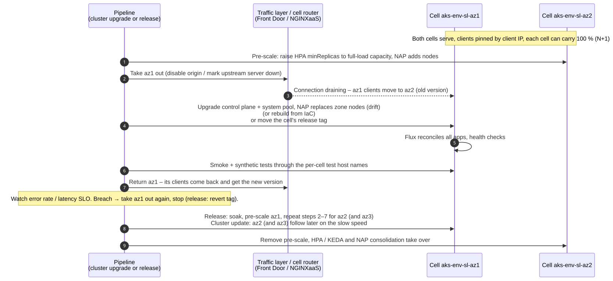

One cell at a time is **taken out of traffic, upgraded and returned** – users never hit a cell that is being
changed. It is the same procedure as an application release ([releases cell by cell](#releases-cell-by-cell)), and the
two never run in the same cell at the same time:

1. pre-scale the remaining cluster(s) to full-load capacity;
2. take the cell out of the traffic layer (disable its Front Door origins, mark it `down` in the NGINXaaS upstreams)
   and wait for connection draining;
3. upgrade the control plane and the system pool; NAP then replaces the zone nodes with the new node image and
   version through drift (the cell's `NodePool` disruption budgets are opened for this while it is out of traffic) – or, for large changes (new VNet, CNI, OS SKU), **create a fresh cluster**
   from IaC and let Flux bootstrap it (blue/green at cluster level);
4. wait until all Flux Kustomizations are `Ready`, run smoke and synthetic tests through the cell's per-cell test
   host names ([incoming traffic](#incoming-traffic-from-outside-and-from-inside));
5. return the cell's clients while watching error-rate and latency SLOs – on Front Door in steps of IP blocks, on
   NGINXaaS in one step; on breach take the cell out again and stop;
6. repeat for the next cell.

Node image / OS security updates follow the same timetable ([update policy](#update-policy)) and the same
procedure: the new node image is set while the cell is drained, and NAP rolls it out to the zone nodes through drift
within its disruption budgets. AKS auto-upgrade and node OS auto-upgrade channels are not used in the stateless clusters,
so nothing changes a cell outside this procedure.
Prerequisite for all of this is **N+1 capacity**: NAP `NodePool` limits, vCPU quota and node subnet size must allow one
cluster to carry the whole environment.

### Stateful cluster


There is only one stateful cluster, so it is upgraded **in place** and protected by zone redundancy:

- **Version policy**: LTS minor version, changed only when absolutely necessary ([update policy](#update-policy)).
  Cluster auto-upgrade channel `none`; Kubernetes patch versions are applied only for one of the listed reasons, by the
  pipeline, dev → acc → prd, preferably control plane only.
- **OS patches in place**: security patches are applied to the **existing nodes** instead of replacing them – node OS
  channel `Unmanaged` (the OS's own unattended upgrades) with reboots coordinated one node at a time (kured), only inside
  the planned maintenance window (`aksManagedNodeOSUpgradeSchedule`), dev a week before acc and two weeks before prd,
  respecting the PDBs. A node is reimaged with a new node image only when an in-place patch is not possible or AKS
  support requires it.
- **Control plane**: zone-redundant (Premium tier); upgrading it does not restart workloads.
- **Node pools**: one fixed-size pool per isolation zone *and* AZ, so a pool upgrade touches only one AZ. Surge settings
  `maxSurge: 1`, `maxUnavailable: 0`, a drain timeout and node soak time; drains respect the PDBs, so at most one
  replica of each StatefulSet is down at any moment. The surge node is created in the same AZ, so zonal disks
  re-attach; ZRS disks additionally allow a pod to move to another AZ. The vCPU quota must leave room for the surge nodes,
  because the pools do not autoscale.
- **LTS minor upgrades** (rare, once per LTS cycle, within the last 6 months of LTS support): the same procedure,
  rehearsed in dev and acc first. Alternative
  for risky jumps: add new node pools on the new version, cordon and drain the old pools AZ by AZ, delete them.

## 13. Encryption in transit and TLS


Every hop is encrypted, but each cluster type does it in the way that costs the applications least.

### Stateless clusters: VNet encryption + TLS-only Traefik gateway

- **No service mesh, no mTLS, no TLS configuration in the applications.** Applications listen on plain HTTP inside the
  cluster. Traffic between pods on the same node never leaves the host; traffic between nodes is encrypted by
  **Azure Virtual Network encryption**, enabled on every stateless spoke VNet (and the hub peering).
  - Requires node VM sizes that support VNet encryption (accelerated networking); because the only enforcement mode is
    `AllowUnencrypted`, an unsupported VM size would silently send clear text. The allowed VM sizes are therefore
    enforced with Azure Policy – on the system pool's VM size and on the SKU requirements of the NAP `NodePool`s – and
    VNet encryption on the VNets.
  - VNet encryption covers VM-to-VM traffic in the VNet and peered VNets. Everything that leaves the stateless cluster
    (to Azure Firewall, the stateful cluster, PaaS, Internet) is TLS anyway – see below.
- **Gateway API only, no Ingress.** HTTP traffic into a cell is configured exclusively with the Kubernetes
  [Gateway API](https://gateway-api.sigs.k8s.io/) (`GatewayClass`, `Gateway`, `HTTPRoute`; `GRPCRoute` where needed),
  standard channel only. The Kubernetes Ingress API is not used anywhere: Traefik runs with only its
  `kubernetesGateway` provider enabled (the `kubernetesIngress` and `kubernetesCRD`/`IngressRoute` providers are off and
  their CRDs are not installed), and Azure Policy rejects `Ingress` objects.
- **Traefik is the Gateway API implementation**, one instance per isolation zone in the platform namespace
  `<zone>-gateway` (a reserved application name) on the zone's nodes, behind an internal load balancer in
  `snet-<zone>-ilb`. The platform owns the `GatewayClass` and one `Gateway` per zone; application teams own only
  `HTTPRoute`s in their namespaces – the Gateway API role split between cluster operator and application developer. `allowedRoutes` selects namespaces with `platform/zone=<zone>`, so a route
  can never attach to another zone's gateway.
- **Internal DNS names with Let's Encrypt certificates.** Each zone has its own DNS name space, e.g.
  `*.ext-fi.prd.example.com`, resolved only by the Private DNS zone in the hub (split horizon: the name has no
  public A record). Traefik serves the zone's wildcard certificate from the platform Key Vault
  ([below](#certificates-issued-centrally-distributed-through-the-platform-key-vault)). Because the certificate is publicly
  trusted, Front Door / NGINXaaS validate the backend without uploading custom root certificates, and
  clients inside the corporate network need no private CA.
- **No non-TLS traffic.** Traefik has only the `websecure` entry point on 443; port 80 is not exposed at all (no
  HTTP→HTTPS redirect listener either), the internal load balancer has only port 443, and the NSG on `snet-<zone>-ilb`
  allows only TCP 443. Azure Policy rejects `Gateway` listeners with protocol `HTTP`, `HTTPRoute`s that do not attach to
  the HTTPS listener, hostnames outside the zone's domain, `Ingress` objects, and `LoadBalancer` / `NodePort` Services
  outside `<zone>-gateway`. Traefik adds HSTS to every response. The traffic layer listens on HTTPS only and
  re-encrypts to Traefik (end-to-end TLS).

### Stateful cluster: the application terminates TLS

- **No Gateway API implementation and no Ingress** – the CRDs are not installed and Azure Policy rejects `Ingress`,
  `Gateway` and `HTTPRoute` objects. Fewer moving parts in the cluster that is hardest to upgrade.
- **Azure CNI (VNet-integrated)**: pod IPs are routable in the backend spoke, so NSGs, the Firewall and Cilium
  policies see real addresses.
- Each application is published with a `LoadBalancer` Service that must be internal
  (`service.beta.kubernetes.io/azure-load-balancer-internal: "true"`), placed in its zone's
  `snet-<zone>-ilb` (`…-internal-subnet` annotation) and use `externalTrafficPolicy: Local`; `NodePort` and public
  load balancers are rejected by Azure Policy.
- **The application handles TLS itself** (TLS 1.2+), which is an onboarding requirement for the stateful cluster: it
  terminates TLS on its listener and reloads the certificate on rotation. Most products that end up here (databases,
  brokers, search engines) support this natively.
- The application uses the **same zone certificate from the platform Key Vault** as Traefik (see below), mounted as PEM files
  through the Secrets Store CSI driver; it is reached under a name in the zone's domain, e.g.
  `app-x.int-fi.prd.example.com`.
- Clients in the stateless clusters connect with TLS and verify the name; plain-text ports are not allowed by the
  Firewall rules between frontend and backend.

### Certificates issued centrally, distributed through the platform Key Vault

No cluster issues certificates – there is no cert-manager or other ACME client in any cluster, so no cluster needs
Internet access to Let's Encrypt or write access to DNS.

- **One platform Key Vault per environment.** `kv-<env>-platform` (RBAC permission model, public access disabled,
  purge protection) exists exactly once per environment, is created by the environment IaC module and is shared by all
  clusters of that environment. It holds **all certificates of the environment** – the zone vaults hold none – plus
  the renewal job's ACME account key. Every cluster spoke has one private endpoint to it in a small shared subnet
  `snet-platform-pe` (control plane zone, [picture 2](#2-network-layout)).
- **Certificates per environment.** Each environment gets its own certificates in its own vault; nothing is copied
  between environments, and a dev or acc identity can never read a prd key:

  | Environment | Platform Key Vault | Certificates (one wildcard per isolation zone) |
  |---|---|---|
  | dev | `kv-dev-platform` | `cert-int-fi-wildcard` (`*.int-fi.dev.example.com`), `cert-int-se-wildcard`, `cert-ext-fi-wildcard`, `cert-ext-se-wildcard` |
  | acc | `kv-acc-platform` | the same names for `*.<zone>.acc.example.com` |
  | prd | `kv-prd-platform` | the same names for `*.<zone>.prd.example.com` |

  The certificate *names* are identical in every environment, so the fleet manifests (`SecretProviderClass`) need
  only the vault name `kv-${ENV}-platform`, substituted from `cluster-vars`. An application that must not share the zone key gets its
  own certificate `cert-<zone>-<app>` in the same vault.
- **One renewal job per environment** runs in the management network (scheduled pipeline or Container Apps job) with
  its own managed identity, which has **Key Vault Certificates Officer and Key Vault Secrets Officer (for the ACME
  account key) on its own environment's platform vault only**.
  It requests the certificates from Let's Encrypt with the **DNS-01** challenge, writes only the `_acme-challenge` TXT
  records into a public Azure DNS validation zone (the zone names are delegated to it by CNAME, so the job cannot
  change any other record) and **imports** the result into the platform vault as Key Vault certificates. It renews
  30 days before expiry; Key Vault `CertificateNearExpiry` events alert the platform team if renewal fails. The jobs
  are rolled out dev → acc → prd like any other platform change.
- **All clusters of an environment use the same certificate**: Traefik in `sl-az1`, `sl-az2`, `sl-az3` and the
  TLS-terminating applications in `sf`. A rebuilt cluster needs no new certificate, and Let's Encrypt rate limits are
  never an issue (a handful of certificates per environment).
- **Access with plain Azure RBAC, no ABAC.** Key Vault RBAC roles can be assigned on a single certificate (its secret
  object) instead of the whole vault. Every identity that needs a certificate – each zone's Traefik, stateful
  applications, any application with a client or server certificate – gets **Key Vault Secrets User** scoped to
  `kv-<env>-platform/secrets/cert-<zone>-…` of *its own zone*. Key Vault exposes a certificate together with its
  private key as a secret of the same name, which is what the Secrets Store CSI driver reads. No identity has a role on
  the vault scope except the renewal job and the platform team (PIM). The role assignments are created by the
  environment IaC module from the application onboarding (a "needs certificate" flag), so a certificate must exist
  before it can be assigned – the module creates it with a short-lived self-signed placeholder (issuer `Self`) that
  the job replaces on its first run.
- **Delivery and rotation** with the Secrets Store CSI driver (rotation enabled, 2-minute poll):
  - Traefik: a `SecretProviderClass` in `<zone>-gateway` syncs the certificate into a `kubernetes.io/tls` Secret, which
    the zone's `Gateway` listener references; Traefik reloads it when the Secret changes.
  - Applications: the certificate and key are mounted as PEM files and the application reloads them on change.
- Things to be aware of:
  - The parent domain must be a **registered public domain** – suffixes like `.internal`, `.local` or `.corp` cannot
    get Let's Encrypt certificates.
  - Certificates appear in public Certificate Transparency logs; the per-zone wildcard keeps application names out
    of them.
  - The wildcard private key is shared by everything in the zone that needs a certificate. Its blast radius is one
    zone of one environment, and it is renewed every 60 days.
  - The platform vault is shared by all zones of an environment, so zone separation for certificates rests on the
    per-certificate role assignments (and Cilium egress policy) rather than on a separate vault. Microsoft recommends
    vault-level assignments in general; per-object assignments are fine here because the number of certificates and
    consumers is small, but they count towards the subscription's role assignment limit.
  - Egress `acme-v02.api.letsencrypt.org` is allowed only for the renewal job, not for any cluster.

## 14. Policy enforcement with the Azure Policy add-on

**The AKS-native [Azure Policy add-on](https://learn.microsoft.com/en-us/azure/governance/policy/concepts/policy-for-kubernetes)
is the single policy engine**, enabled by the cluster IaC in every cluster. It runs Gatekeeper, but AKS installs and
upgrades it, and the policies are ordinary Azure Policy definitions and assignments – the same tool that governs the
Azure resources (cluster settings, allowed VM sizes, VNet encryption, local auth disabled, private endpoints only).
No Gatekeeper is installed by Flux.

- **Assignments per environment subscription** (`sub-aks-dev`, `sub-aks-acc`, `sub-aks-prd`), so a new or rebuilt
  cluster gets every policy automatically. Compliance of all clusters is visible in one place (Azure Policy, Defender
  for Cloud).
- **Built-in definitions first**: the Kubernetes pod security *restricted* initiative, allowed images, required
  probes and resource requests, and [deployment safeguards](https://learn.microsoft.com/en-us/azure/aks/deployment-safeguards).
- **Custom definitions** (`Microsoft.Kubernetes.Data` mode) for the platform's own rules, with the constraint or
  mutation template embedded as Base64 in the definition. Templates are kept in the IaC repository and tested in CI
  with `gator verify`; CEL-based definitions (generated as Kubernetes `ValidatingAdmissionPolicy`, evaluated
  in-process) are preferred for new validations where they can express the rule.
- **Rollout dev → acc → prd**: definitions are versioned; a new or changed definition is assigned with effect `audit`
  in dev, then `deny`, then promoted to acc and prd with the rest of the platform change.
- **Platform namespaces**: `kube-system` and `gatekeeper-system` are excluded by the add-on; `flux-system` and other
  platform namespaces are excluded from application rules through the definitions' namespace exclusion parameters.
  `<zone>-gateway` is excluded only from the rules that Traefik itself must break (its `LoadBalancer` Service, the
  synced TLS Secret) – zone pinning still applies to it.

Limits of the add-on and how the design handles them:

| Limit | Consequence in this design |
|---|---|
| Needs `data.policy.core.windows.net`, `store.policy.core.windows.net`, `dc.services.visualstudio.com` (+ Entra ID); no Private Link | Firewall application rules for these FQDNs, also from the stateful cluster (exception to "no Internet", see [flows](#flows-between-frontend-and-backend)) |
| Custom definitions cannot use Gatekeeper data replication (no lookups of other objects) | Zone rules match the namespace name prefix `<zone>-*`; "PDB exists for every Deployment / StatefulSet" is checked in CI on the rendered manifests, because Flux and the stateful pipeline only apply validated artifacts |
| Policies are synced from Azure every 15 minutes | The stateless cluster bootstrap keeps the Flux `apps` Kustomization suspended until all assigned constraint templates and constraints are present in the cluster; the stateful pipeline checks the same before every run |
| Gatekeeper config cannot be changed | No custom Gatekeeper settings; defaults are fine for this design |
| Max 10 000 pods per cluster | Well above the expected size; monitored |

| Policy | All clusters | Stateless | Stateful |
|---|---|---|---|
| Namespace `<zone>-*` has label `platform/zone=<zone>`; pod nodeSelector / toleration match the prefix (mutation + validation) | ✔ | | |
| Images by digest from the environment's ACR only | ✔ | | |
| ServiceAccount used by application pods carries the workload identity client ID; no `imagePullSecrets` | ✔ | | |
| No `Opaque` / basic-auth / docker-config `Secret`s in application namespaces (Helm release secrets allowed); `secretObjects` in `SecretProviderClass` only for the `kubernetes.io/tls` certificate in `<zone>-gateway` | ✔ | | |
| Requests set, probes set, no privileged / hostNetwork / hostPath for applications | ✔ | | |
| Replica and rollout guardrails (PDB existence: CI check) of [section 11](#11-zero-downtime-application-upgrades) | ✔ | ≥ 2 replicas | ≥ 3 replicas, zone spread |
| Reject `PersistentVolumeClaim` | | ✔ | |
| NAP `NodePool` / `AKSNodeClass`: subnet, `platform/zone` label, taint and AZ of its zone; only allowed VNet-encryption-capable VM sizes | | ✔ | |
| Reject `Ingress`; only HTTPS `Gateway` listeners; `HTTPRoute` only to the zone's HTTPS listener and zone domain | | ✔ | |
| Reject `LoadBalancer` / `NodePort` Services outside `<zone>-gateway` | | ✔ | |
| Reject `Ingress`, `Gateway`, `HTTPRoute`; `LoadBalancer` only internal, in the zone's ILB subnet, `externalTrafficPolicy: Local`; no `NodePort` | | | ✔ |
| Namespace has `platform/stateful-exception` | | | ✔ |

---

## Open questions

- Single cluster with zones vs. one cluster per zone (or per country) – trade-off between operational cost and
  blast radius / hard network boundary.
- Can the corporate IP plan reserve a `/12` per environment for the platform (or a `/17` per country if not), and
  is the platform the owner of these prefixes in the central IPAM?
- Is CoreDNS on the shared system pool acceptable, or should each zone run its own DNS (e.g. NodeLocal DNS)?
- One Front Door profile per environment with a WAF policy per external zone (current draft), or a profile per zone?
- Release cadence: is one fleet release train per environment and day (or a few) fast enough, given that each cell
  costs a drain, rollout, tests and a return ramp? Which applications need a faster path?
- Client-IP affinity: how much traffic comes from large NATs (corporate proxies, carrier-grade NAT) or from clients
  that change addresses? This decides how even the load is and how many clients can meet both versions in a release.
- Internal entry point: is F5 NGINXaaS (an Azure partner service) acceptable, and is NGINX App Protect WAF generally
  available for it in our region? Alternatives: self-managed NGINX/Envoy with consistent hashing on VM scale sets, or
  Application Gateway with cookie affinity, accepting that cookie-less internal clients see both versions.
- Node auto provisioning in the stateless clusters: confirm that NAP with custom subnets per `NodePool` is supported
  (and generally available) in our region together with a private cluster, API Server VNet Integration, outbound type
  `userDefinedRouting` and the Azure Policy add-on. Fallback: classic node pools per zone with the cluster autoscaler.
- In-place OS patching of the stateful cluster (node OS channel `Unmanaged`) needs the OS package repositories, but
  the cluster is network isolated: is a private package mirror in the backend network acceptable, and is the channel
  supported for network isolated clusters? If not, the fallback is node OS channel `SecurityPatch` (security-only node
  images, which replaces nodes) inside the maintenance window.
- Update speeds: does `sl-az2` running the oldest supported minor leave enough time for its 1-month steps in every
  AKS release cycle, and should `sl-az3` follow the slow speed (current draft) or the fast one? With NAP, confirm that
  nodes created during scale-out use the pinned node image, not the newest one.
- Key Vault ABAC is preview – acceptable for production, or fall back to vault per application until GA? (Affects only
  applications with a secret exception.)
- Which application stacks lack Entra ID support in their drivers/SDKs, and are they upgraded or given a secret
  exception?
- Two or three stateless clusters per environment? Two is the minimum, but then each must carry 100 % of the load and
  an AZ outage *during* an upgrade leaves no redundancy; three needs only 50 % headroom per cluster.
- "No Internet" for the stateful cluster: is the Entra ID (`AzureActiveDirectory` service tag) exception for workload
  identity acceptable, or must stateful workloads avoid Entra-authenticated access?
- Which workloads are expected to get a stateful-cluster exception, and when? The stateful cluster is built only when
  the first one is approved; is it then built in all three environments at once (recommended, to keep the topology
  identical)?
- Is one wildcard certificate per zone and environment acceptable, or do some applications need their own
  certificate (own key)?
- One platform Key Vault per environment shared by all zones (current draft), or one certificate vault per zone and
  environment if a separate vault per country is a hard requirement for keys too?
- DNS naming for the internal Let's Encrypt names (`<zone>.<env>.example.com`) and who owns the public
  validation zone.
- "No Internet" for the stateful cluster: are the Azure Policy add-on FQDNs acceptable as a second exception next to
  Entra ID?

## Editing the pictures

Sources are Mermaid files in [`diagrams/`](diagrams); rendered SVGs live in [`images/`](images).
After editing a source, regenerate with:

```sh
scripts/render.sh
```
