# 1. Overview

Hub-and-spoke landing zone. The **hub** holds the shared connectivity services: Azure Firewall (all egress and
east-west inspection), VPN/ExpressRoute gateway, Private DNS and Bastion. A separate **management VNet** hosts
jump hosts and CI/CD agents and is the only place the Kubernetes API can be reached from.
Each **AKS spoke** contains one cluster split into a control plane zone and four workload isolation zones.
Every cluster of the fleet – stateless or stateful – has this same inner layout; how the clusters are placed in
the frontend and backend networks is shown in [picture 8](08-cluster-types-stateless-and-stateful.md).
External zones receive Internet traffic through Azure Front Door Premium (WAF, Private Link to the clusters);
internal zones are reached only from the corporate network through the firewall and an internal Application Gateway entry point. In both cases the traffic ends at the zone's Traefik gateway
in a stateless cluster – the stateful cluster is never reached from outside the platform.

---

[Back to contents](../README.md) · Previous: [Requirements](requirements.md) · Next: [2. Network layout](02-network-layout.md)
