# 6. Workload identity first, Key Vault secrets only when needed

**Rule: an application authenticates with its workload identity wherever the target supports Microsoft Entra ID;
a secret is used only when there is no other way.** No passwords, connection strings with keys, SAS tokens or
storage account keys for Azure services.

## Workload identity per application

- Each application has, per isolation zone and environment, its own user-assigned managed identity
  (`id-<zone>-<app>`), created by IaC together with the namespace. Its Kubernetes ServiceAccount carries the
  `azure.workload.identity/client-id` annotation; pods get a short-lived projected token that is exchanged for an
  Entra ID token – nothing long-lived is stored anywhere.
- **Federated credentials per cluster**: every cluster has its own OIDC issuer, so the identity has one federated
  credential per cluster of the environment (`sl-az1`, `sl-az2`, (`sl-az3`), `sf`) for subject
  `system:serviceaccount:<namespace>:<app>`. A rebuilt stateless cluster gets a new issuer; the IaC that creates the
  cluster also updates the federated credentials (a managed identity allows at most 20).
- The identity gets **data-plane roles directly on the Azure resources of its zone**, never on other zones:

| Target | How the application authenticates | Local auth disabled with |
|---|---|---|
| Azure SQL Database | Entra token (`Active Directory Default` in the driver), contained database user for the identity | Entra-only authentication |
| Azure Database for PostgreSQL | Entra token as password, role mapped to the identity | Entra-only authentication |
| Storage (Blob, Queue, Table, Files REST) | `Storage Blob Data …` roles | `allowSharedKeyAccess: false` |
| Service Bus, Event Hubs | `… Data Sender / Receiver` roles | `disableLocalAuth: true` |
| Cosmos DB | Cosmos DB data-plane RBAC | `disableLocalAuth: true` |
| Azure Cache for Redis | Entra authentication, access policy for the identity | access keys disabled |
| Key Vault (only for the secrets below) | `Key Vault Secrets User` with ABAC condition | RBAC permission model |
| Other Azure APIs (App Configuration, Azure OpenAI, …) | Azure RBAC roles | `disableLocalAuth` where available |

  "Local auth disabled" is enforced with Azure Policy on the resources, so a key-based fallback cannot be switched
  on later. Application configuration contains only endpoints and client IDs, which are not secrets.
- **Platform components use workload identity too**: Flux (`OCIRepository` `provider: azure`), the stateful
  deployment pipeline (workload identity federation, no client secret), Traefik's certificate
  mount (Secrets Store CSI driver), the Azure Monitor agent, external-dns. Images are pulled
  with the kubelet identity, which has only `AcrPull` on the environment's ACR – no `imagePullSecrets`.

## Secrets only when needed

A secret is allowed only when the target cannot use Entra ID: third-party APIs and SaaS keys, partner systems and
legacy protocols. TLS certificates are **not** in the zone vaults; they live in the environment's platform Key Vault
([section 13](13-encryption-in-transit-and-tls.md#certificates-issued-centrally-distributed-through-the-platform-key-vault)).
Such a secret always lives in the zone's **Key Vault** – never in Git, Helm values or a Kubernetes `Secret` created by
hand.

Each zone has its **own Key Vault per environment** (`kv-<env>-<zone>`, RBAC permission model, public access
disabled), shared by all clusters of the environment, with a private endpoint in the zone's `snet-<zone>-pe` of every
cluster spoke. Inside a zone's vault, applications share the vault but are separated with
[Azure ABAC conditions](https://learn.microsoft.com/en-us/azure/key-vault/general/rbac-abac):

- The application's workload identity gets **Key Vault Secrets User** on the zone vault with condition
  `@Resource[Microsoft.KeyVault/vaults/secrets:name] StringStartsWith '<app>-'`.
- Application pipelines get **Key Vault Secrets Officer** with the same prefix on
  `@Request[...secrets:name]` for `setSecret`; rotation is owned by the application team (expiry dates set, Event
  Grid `SecretNearExpiry` alerts).
- Secrets are mounted as **files** with the Secrets Store CSI driver; syncing them into Kubernetes `Secret` objects
  (`secretObjects`) is rejected by policy (only the TLS certificate in `<zone>-gateway` is synced, for Traefik), as
  are hand-made `Opaque` Secrets in application namespaces
  ([section 14](14-policy-enforcement.md)).

Constraints to keep in mind: Key Vault ABAC is **preview**, supports **secrets only** (not keys/certificates
operations) and only **vault name + secret name** attributes, and lowercase values. Therefore the secret naming
convention `<app>-<secret>` is mandatory and must be enforced by the platform. A name condition on
`readMetadata` breaks list calls – gate `getSecret` instead. Because most applications need no secrets at all, the
vault stays small and the preview dependency affects only the few exceptions.

---

[Back to contents](../README.md) · Previous: [5. Allowed and blocked flows](05-allowed-and-blocked-flows.md) · Next: [7. Application multi-tenancy inside a zone](07-application-multi-tenancy.md)
