# 13. Encryption in transit and TLS

Every hop is encrypted, but each cluster type does it in the way that costs the applications least. Encryption at
rest with customer-managed keys is in [section 18](18-encryption-at-rest-and-customer-managed-keys.md).

## Stateless clusters: VNet encryption + TLS-only Traefik gateway

- **No service mesh, no mTLS, no TLS configuration in the applications.** Applications listen on plain HTTP inside the
  cluster. Traffic between pods on the same node never leaves the host; traffic between nodes is encrypted by
  **Azure Virtual Network encryption**, enabled on every stateless spoke VNet (and the hub peering).
  - Requires node VM sizes that support VNet encryption (accelerated networking); because the only enforcement mode is
    `AllowUnencrypted`, an unsupported VM size would silently send clear text. The allowed VM sizes are therefore
    enforced with Azure Policy – on the system pool's VM size and on the SKU requirements of the NAP `NodePool`s – and
    VNet encryption on the VNets.
  - VNet encryption covers VM-to-VM traffic in the VNet and peered VNets. Everything that leaves the stateless cluster
    (to Azure Firewall, the stateful cluster, PaaS, Internet) is TLS anyway – see below.
- **Gateway API only, no Ingress.** HTTP traffic into a cell is configured exclusively with the Kubernetes
  [Gateway API](https://gateway-api.sigs.k8s.io/) (`GatewayClass`, `Gateway`, `HTTPRoute`; `GRPCRoute` where needed),
  standard channel only. The Kubernetes Ingress API is not used anywhere: Traefik runs with only its
  `kubernetesGateway` provider enabled (the `kubernetesIngress` and `kubernetesCRD`/`IngressRoute` providers are off and
  their CRDs are not installed), and Azure Policy rejects `Ingress` objects.
- **Traefik is the Gateway API implementation**, one instance per isolation zone in the platform namespace
  `<zone>-gateway` (a reserved application name) on the zone's nodes, behind an internal load balancer in
  `snet-<zone>-ilb`. The platform owns the `GatewayClass` and one `Gateway` per zone; application teams own only
  `HTTPRoute`s in their namespaces – the Gateway API role split between cluster operator and application developer. `allowedRoutes` selects namespaces with `platform/zone=<zone>`, so a route
  can never attach to another zone's gateway.
- **Internal DNS names with Let's Encrypt certificates.** Each zone has its own DNS name space, e.g.
  `*.ext-fi.prd.example.com`, resolved only by the Private DNS zone in the hub (split horizon: the name has no
  public A record). Traefik serves the zone's wildcard certificate from the platform Key Vault
  ([below](#certificates-issued-centrally-distributed-through-the-platform-key-vault)). Because the certificate is publicly
  trusted, Front Door / NGINXaaS validate the backend without uploading custom root certificates, and
  clients inside the corporate network need no private CA.
- **No non-TLS traffic.** Traefik has only the `websecure` entry point on 443; port 80 is not exposed at all (no
  HTTP→HTTPS redirect listener either), the internal load balancer has only port 443, and the NSG on `snet-<zone>-ilb`
  allows only TCP 443. Azure Policy rejects `Gateway` listeners with protocol `HTTP`, `HTTPRoute`s that do not attach to
  the HTTPS listener, hostnames outside the zone's domain, `Ingress` objects, and `LoadBalancer` / `NodePort` Services
  outside `<zone>-gateway`. Traefik adds HSTS to every response. The traffic layer listens on HTTPS only and
  re-encrypts to Traefik (end-to-end TLS).

## Stateful cluster: the application terminates TLS

- **No Gateway API implementation and no Ingress** – the CRDs are not installed and Azure Policy rejects `Ingress`,
  `Gateway` and `HTTPRoute` objects. Fewer moving parts in the cluster that is hardest to upgrade.
- **Azure CNI (VNet-integrated)**: pod IPs are routable in the backend spoke, so NSGs, the Firewall and Cilium
  policies see real addresses.
- Each application is published with a `LoadBalancer` Service that must be internal
  (`service.beta.kubernetes.io/azure-load-balancer-internal: "true"`), placed in its zone's
  `snet-<zone>-ilb` (`…-internal-subnet` annotation) and use `externalTrafficPolicy: Local`; `NodePort` and public
  load balancers are rejected by Azure Policy.
- **The application handles TLS itself** (TLS 1.2+), which is an onboarding requirement for the stateful cluster: it
  terminates TLS on its listener and reloads the certificate on rotation. Most products that end up here (databases,
  brokers, search engines) support this natively.
- The application uses the **same zone certificate from the platform Key Vault** as Traefik (see below), delivered by
  External Secrets Operator as a `kubernetes.io/tls` Secret and mounted as PEM files; it is reached under a name in the zone's domain, e.g.
  `app-x.int-fi.prd.example.com`.
- Clients in the stateless clusters connect with TLS and verify the name; plain-text ports are not allowed by the
  Firewall rules between frontend and backend.

## Certificates issued centrally, distributed through the platform Key Vault

No cluster issues certificates – there is no cert-manager or other ACME client in any cluster, so no cluster needs
Internet access to Let's Encrypt or write access to DNS.

- **One platform Key Vault per environment.** `kv-<env>-platform` (RBAC permission model, public access disabled,
  purge protection) exists exactly once per environment, is created by the environment IaC module and is shared by all
  clusters of that environment. It holds **all certificates of the environment** – the zone vaults hold none – plus
  the renewal job's ACME account key, and the customer-managed keys of the environment's clusters
  ([section 18](18-encryption-at-rest-and-customer-managed-keys.md)). Every cluster spoke has one private endpoint to it in a small shared subnet
  `snet-platform-pe` (control plane zone, [picture 2](02-network-layout.md)).
- **Certificates per environment.** Each environment gets its own certificates in its own vault; nothing is copied
  between environments, and a dev or acc identity can never read a prd key:

  | Environment | Platform Key Vault | Certificates (one wildcard per isolation zone) |
  |---|---|---|
  | dev | `kv-dev-platform` | `cert-int-fi-wildcard` (`*.int-fi.dev.example.com`), `cert-int-se-wildcard`, `cert-ext-fi-wildcard`, `cert-ext-se-wildcard` |
  | acc | `kv-acc-platform` | the same names for `*.<zone>.acc.example.com` |
  | prd | `kv-prd-platform` | the same names for `*.<zone>.prd.example.com` |

  The certificate *names* are identical in every environment, so the fleet manifests (`SecretStore`, `ExternalSecret`) need
  only the vault name `kv-${ENV}-platform`, substituted from `cluster-vars`. An application that must not share the zone key gets its
  own certificate `cert-<zone>-<app>` in the same vault.
- **One renewal job per environment** runs in the management network (scheduled pipeline or Container Apps job) with
  its own managed identity, which has **Key Vault Certificates Officer and Key Vault Secrets Officer (for the ACME
  account key) on its own environment's platform vault only**.
  It requests the certificates from Let's Encrypt with the **DNS-01** challenge, writes only the `_acme-challenge` TXT
  records into a public Azure DNS validation zone (the zone names are delegated to it by CNAME, so the job cannot
  change any other record) and **imports** the result into the platform vault as Key Vault certificates. It renews
  30 days before expiry; Key Vault `CertificateNearExpiry` events alert the platform team if renewal fails. The jobs
  are rolled out dev → acc → prd like any other platform change.
- **All clusters of an environment use the same certificate**: Traefik in `sl-az1`, `sl-az2`, `sl-az3` and the
  TLS-terminating applications in `sf`. A rebuilt cluster needs no new certificate, and Let's Encrypt rate limits are
  never an issue (a handful of certificates per environment).
- **Access with plain Azure RBAC, no ABAC.** Key Vault RBAC roles can be assigned on a single certificate (its secret
  object) instead of the whole vault. The secret reader identity ([section 6](06-workload-identity-and-secrets.md#delivered-only-by-external-secrets-operator))
  of every namespace that needs a certificate – `<zone>-gateway` for the zone's Traefik (`id-<zone>-gateway-secrets`),
  stateful applications, any application with a client or server certificate – gets **Key Vault Secrets User** scoped
  to `kv-<env>-platform/secrets/cert-<zone>-…` of *its own zone*; only External Secrets Operator uses it. Key Vault
  exposes a certificate together with its private key as a secret of the same name, which is what ESO reads. Neither
  Traefik nor any application calls Key Vault itself. No identity has a data-plane role on
  the vault scope except the renewal job and the platform team (PIM); the clusters' control plane identities have Key
  Vault Contributor (management plane only) for KMS ([section 18](18-encryption-at-rest-and-customer-managed-keys.md#trade-off-cluster-identities-on-the-shared-platform-vault)). The role assignments are created by the
  environment IaC module from the application onboarding (a "needs certificate" flag), so a certificate must exist
  before it can be assigned – the module creates it with a short-lived self-signed placeholder (issuer `Self`) that
  the job replaces on its first run.
- **Delivery and rotation** with the zone's External Secrets Operator (the Secrets Store CSI driver is disabled):
  an `ExternalSecret` reads the certificate's secret object (PEM content type) through the namespace's platform-vault
  `SecretStore` and its template writes a `kubernetes.io/tls` Secret (`tls.crt` with the chain, `tls.key`). The
  refresh interval is 1 hour – a renewed certificate is in every cluster well within the 30-day renewal margin.
  - Traefik: the `ExternalSecret` in `<zone>-gateway` writes the Secret that the zone's `Gateway` listener
    references; Traefik reloads it when the Secret changes.
  - Applications: the Secret is mounted as PEM files (no `subPath`) and the application reloads them on change.
- Things to be aware of:
  - The parent domain must be a **registered public domain** – suffixes like `.internal`, `.local` or `.corp` cannot
    get Let's Encrypt certificates.
  - Certificates appear in public Certificate Transparency logs; the per-zone wildcard keeps application names out
    of them.
  - The wildcard private key is shared by everything in the zone that needs a certificate. Its blast radius is one
    zone of one environment, and it is renewed every 60 days.
  - The platform vault is shared by all zones of an environment, so zone separation for certificates rests on the
    per-certificate role assignments (and Cilium egress policy) rather than on a separate vault. Microsoft recommends
    vault-level assignments in general; per-object assignments are fine here because the number of certificates and
    consumers is small, but they count towards the subscription's role assignment limit.
  - Egress `acme-v02.api.letsencrypt.org` is allowed only for the renewal job, not for any cluster.

---

[Back to contents](../README.md) · Previous: [12. Zero-downtime cluster upgrades](12-zero-downtime-cluster-upgrades.md) · Next: [14. Policy enforcement with the Azure Policy add-on](14-policy-enforcement.md)
