# 15. AI-driven day 2 operations



This design was written by AI, and the platform it describes is built to be operated mostly by AI too: upgrades,
capacity, cost, compliance, drift, incident triage and application onboarding are run by **agents**. Agents may
change every environment, prd included, but **only the way a human platform engineer would: with a pull request to
the IaC or fleet repository**. Humans no longer make most of the changes; they own the **guardrails** that decide
which changes can be merged and by whom.

**Rules**

1. **Git is the only write path.** No agent has write access to Azure, to a cluster, to Key Vault secrets or to the
   `main` branch. Everything an agent changes goes through a pull request and is applied by the existing delivery
   ([section 10](10-keeping-clusters-in-sync.md)): IaC pipelines, Flux and the stateful pipeline, with their own
   deployment identities that only run from the protected `main` branch.
2. **Agents observe with read-only identities, act with pull requests.** Every agent has its own identity per
   environment, with the least read access its task needs, and no access to application data.
3. **Guardrails are deterministic and owned by humans.** What may be merged is decided by checks, limits and
   approval rules in a separate guardrails repository that agents can read but not change, not by an agent's
   judgement – an agent cannot label its own change as low risk.
4. **Risk decides the approvals, not the environment alone.** A small change inside the limits merges automatically,
   also in prd; anything that touches identity, network, policy, data or the guardrails needs one or two humans.
5. **The design documents are the specification.** Agents read this repository as their context and cite the
   section a change follows; a change the design does not cover is a design change, made here first, by pull request.
6. **The runtime guardrails stay the last line.** Azure Policy, the admission policies of [section 14](14-policy-enforcement.md),
   cell-by-cell rollouts with SLO gates and automatic rollback stop a wrong change that got merged, whoever wrote it.

## Agents

One agent per responsibility, each with its own identity, tool allow-list and instructions, so that a confused or
manipulated agent can only do what its role allows. Agent instructions (prompts, tools, allowed repositories and
paths) are kept in the guardrails repository, versioned like code.

| Agent | Responsibility | Triggered by | Output |
|---|---|---|---|
| **Operations agent** (on-call) | Triage alerts, correlate metrics, logs, Flux and pipeline status, Azure Resource Health; diagnose; verify that a fix worked; draft the incident report | Azure Monitor alerts, Flux notifications, failed pipeline runs, schedule (daily health report) | Incident issue with diagnosis and evidence, task for a change agent, dispatch of a [safe runbook action](#safe-actions-without-a-pull-request) |
| **Platform change agent** | General IaC and fleet changes: fixes from incidents, platform component versions (Traefik, KEDA, operators, External Secrets Operator), configuration | Task from the operations agent, issue assigned by a human | Pull request |
| **Upgrade agent** | Runs the [update policy](12-zero-downtime-cluster-upgrades.md#update-policy): takes the target versions the version pipeline computes (the timetable stays deterministic), reads the release notes, checks the fleet manifests for removed APIs on the target minor, follows the cell-by-cell rollout and stops it on failed health | Version pipeline output, AKS release events | Version pull requests per environment and speed with a compatibility report; halt + incident on failed health |
| **Release agent** | Prepares the application promotion pull requests dev → acc → prd ([section 10](10-keeping-clusters-in-sync.md)), summarises the change set, watches the cell gates | Successful release in the previous environment | Promotion pull request with release notes and risk summary |
| **Capacity and cost agent** | NAP `NodePool` limits, spot share, amd64 / arm64 fit, system pool and stateful node pool sizes, quota headroom, idle resources; suggests right-sizing to application teams | Schedule (weekly), quota and budget alerts | Pull requests within `limits.yaml`, issues to application teams |
| **Security and compliance agent** | Azure Policy non-compliance, Defender for Cloud recommendations, image CVEs of platform components, certificate and secret expiry, policy `audit` → `deny` promotion ([section 14](14-policy-enforcement.md)), stateful-cluster drift report | Schedule (daily), Defender / Key Vault events | Pull requests for platform findings, issues to application teams for theirs |
| **Onboarding agent** | Turns an application team's request (new application, zone, identity, Key Vault secret exception, arch / capacity choice) into the IaC and fleet changes: namespace, managed identity, federated credentials, role assignments, overlays | Issue from a request template | Pull requests – always tier medium or high, because they create identities |
| **Reviewer agent** | Reviews every agent pull request against this design and the evidence: does the change do what its intent says, is the rollback plan real, does it widen access; its review is a required check, never a human approval | Every pull request | Review with findings |

The **reviewer agent never reviews its own work**: it runs with a separate context, its own instructions and, where
possible, a different model than the author, and it only sees the pull request, the plan output and the design
documents. Human pull requests get the same review.

Every agent pull request has the same structure, enforced by the merge gate: **intent** (the issue or alert it
answers), **evidence** (queries and links to metrics), the **design section** it follows, the **plan** (IaC plan /
what-if and rendered manifest diff, attached by CI, not written by the agent), the **rollback** and the
**risk tier** computed by the gate. Commits carry trailers `Agent: <name>` and `Agent-Run: <id>`, so every line in
Git leads back to the agent run and its transcript.

## Repositories and the merge gate

| Repository | Content | Agents | Humans |
|---|---|---|---|
| IaC repository (exists) | Environment and cluster modules, Azure Policy, identities, network, target versions | Pull requests from `agent/*` branches | Approve by tier; merge to `main` only through the merge gate |
| Fleet repository (exists) | In-cluster state ([section 10](10-keeping-clusters-in-sync.md)) | Pull requests from `agent/*` branches | Approve by tier |
| **Guardrails repository** (new) | `limits.yaml`, risk tier rules, plan and manifest policies (OPA / Conftest), the merge gate workflow, CODEOWNERS of the other repositories, agent instructions and tool allow-lists, the IaC of the agent identities | Read only | Two approvals (platform + security) for every change |
| **Runbooks repository** (new) | Pre-approved safe actions as parameterised pipelines | May only dispatch them | Own and change them |
| This design repository | The specification | Pull requests (design changes) | Approve every change |

The examples use GitHub; Azure DevOps offers the same with branch policies, required reviewers and build validation.

- **`main` is protected by an organisation ruleset** that no repository admin or app can bypass: pull request
  required, linear history, signed commits, stale approvals dismissed on push, and the most recent push approved by
  someone other than its author.
- **The merge gate is a required workflow defined in the guardrails repository**, so an agent cannot change the
  check by changing the repository it is checked in. It:
  1. waits for CI to attach the **plan** – `terraform plan` / Bicep what-if as JSON for the IaC repository, rendered
     manifests per cluster and environment for the fleet repository;
  2. evaluates the plan, not the diff, against the policies and `limits.yaml` (below);
  3. computes the **risk tier** from what the plan does (resource types, actions, environments), never from a label
     set by the author;
  4. checks the approvals the tier requires: the reviewer agent, and humans from the CODEOWNERS teams. Agents' apps
     are never members of those teams, so an agent approval can never count as a human one;
  5. enables auto-merge for tier low; for the others it waits for the approvals.
- **Change windows and freezes** are part of `limits.yaml`; outside a window a prd pull request waits, unless it is
  marked as an incident fix by a human.
- **Rate limits per agent**: open pull requests, merges per day and environment, and **one prd cell per pull
  request** – the gate rejects a pull request that changes more than one cell's tag or version at a time, so the
  cell-by-cell rule of [section 11](11-zero-downtime-application-upgrades.md#releases-cell-by-cell) also holds for agents.

## Risk tiers

| Tier | Examples | Required to merge |
|---|---|---|
| **Low** | Patch version or node image per the update timetable; promotion of image digests that run in acc and passed all its gates; HPA / KEDA bounds, NAP `NodePool` limits, spot share and node pool sizes inside `limits.yaml`; alert rules and dashboards; platform component patch versions; documentation | Plan, policy and CI checks green + reviewer agent; auto-merge (prd only inside a change window) |
| **Medium** | Kubernetes minor upgrade of a stateless cell; platform component minor versions; new application in an existing zone; Azure Policy definition rollout `audit` → `deny`; changes over a `limits.yaml` soft limit; any change the reviewer agent flags | Low + **1 human** from the platform team |
| **High** | Role assignments and identities (outside the onboarding pattern), federated credentials, NSG / Firewall / route / address plan, new country, Key Vault access, deletion of anything that holds data (Key Vault, ACR, storage, databases, the stateful cluster), stateful cluster version changes, Azure Policy exemptions, changes to CI / pipeline definitions | Low + **2 humans**: platform and security |
| **Not allowed for agents** | Changes in the guardrails or runbooks repositories, the agents' own identities and permissions, rulesets, break-glass, disabling Azure Policy assignments | Humans only, in the guardrails repository |

`limits.yaml` holds the numbers the gate checks, for example:

```yaml
environments:
  prd:
    changeWindows: ["Mon-Thu 08:00-15:00 Europe/Helsinki"]
    freezes: ["2026-12-18/2027-01-06"]
    maxMergesPerDay: { upgrade-agent: 2, capacity-agent: 3, platform-agent: 5 }
    nodePools:
      maxNodesPerZone: { soft: 60, hard: 120 }     # over soft = medium, over hard = rejected
      maxSpotShare: 0.5
    allowedVmSizes: [Standard_D4ads_v6, Standard_D8ads_v6, Standard_D4pds_v6, Standard_D8pds_v6]
kubernetes:
  allowedMinors: { stateless: ["1.33", "1.34"], stateful: ["1.34"] }   # filled by the upgrade agent's PR, approved per tier
forbidden:
  - action: delete
    types: [Microsoft.KeyVault/vaults, Microsoft.ContainerRegistry/registries, Microsoft.Storage/storageAccounts, Microsoft.Sql/servers]
  - action: roleAssignment
    roles: [Owner, User Access Administrator, Role Based Access Control Administrator]
```

Policies in the gate cover what Azure Policy cannot see before deployment: deletions and replacements in the plan
(a "replace" of a stateful resource is treated as a delete), blast radius (number of resources, number of cells),
address spaces outside the IPAM allocation, Firewall rules to `0.0.0.0/0` or `*`, role assignments wider than a
zone, and the rendered manifests against the same constraint templates as the clusters.

## Identities and access rights

Agents run as container jobs in the **management VNet** (management subscription), the same network as the pipeline
agents; their only egress is the model endpoint (private endpoint), the Git platform and an allow-list of
documentation sites, through the hub Firewall. Each agent has, **per environment, its own user-assigned managed
identity** with workload identity federation (no client secrets) and its **own GitHub App** with short-lived
installation tokens. The identities and their role assignments are IaC in the guardrails repository.

**Azure (per environment subscription, read only)**

| Agent | Azure roles | Never |
|---|---|---|
| All agents | `Reader` on the environment subscription; `Monitoring Reader`; `Log Analytics Reader` limited to the platform tables (table-level RBAC – no application logs that may hold personal data) | Any write role, `Contributor`, `Owner`, `User Access Administrator`, PIM eligibility |
| Operations, platform, upgrade, release | `Azure Kubernetes Service RBAC Reader` on the clusters (does not include `Secret`s); read access to the Flux and pipeline status | `Azure Kubernetes Service RBAC Writer` / `Cluster Admin`, `listClusterAdminCredential` |
| Capacity and cost | `Cost Management Reader`; quota read | – |
| Security and compliance | `Security Reader`; `Key Vault Reader` on the zone and platform vaults (metadata and expiry dates, not values) | `Key Vault Secrets User` / `Officer`, `Key Vault Certificate User` |
| Onboarding, reviewer | `Reader` only | – |

No agent has a data-plane role on the PaaS services or the ACR: they do not need application data to run the
platform, and a prompt injection through a log line or an issue then cannot exfiltrate it. Only the guardrails
pipeline may create role assignments for agent identities; any other role assignment to one of them triggers an
Activity Log alert, and a daily comparison against the guardrails IaC reports and removes it.

**Git platform**

| Agent | GitHub App permissions | Repositories |
|---|---|---|
| Change agents (platform, upgrade, release, capacity, security, onboarding) | `contents: write` only on `agent/<name>/*` branches (ruleset), `pull_requests: write`, `issues: write` | IaC, fleet, design |
| Operations agent | `issues: write`; `actions: write` | Issues in IaC and fleet; dispatch in the runbooks repository only |
| Reviewer agent | `pull_requests: write` (reviews), `checks: write` | IaC, fleet, design |
| All | `contents: read` | Guardrails, runbooks |

**Deployment identities (unchanged, not agents)**: the existing IaC pipeline, Flux and stateful pipeline
identities are the only ones with write access. Their federated credentials accept only tokens for the protected
`main` branch and the GitHub environment of the target (`repo:<org>/<repo>:environment:prd`), so a pull request
branch – an agent's or a human's – can never deploy.

**Humans**: platform and security engineers approve pull requests and own the guardrails; their Azure access
stays read-only plus break-glass via PIM ([section 9](09-environments.md)). A break-glass action is followed by a
pull request that brings Git back in line, opened by the operations agent from the drift it detects.

## Safe actions without a pull request

Some incidents cannot wait for a pull request, but all of them are in the **safe direction**: stopping, or
moving traffic away from a failing cell, not starting. They are parameterised pipelines in the runbooks repository, run with the existing deployment identities;
the operations agent may only dispatch them:

| Action | Limits enforced by the runbook |
|---|---|
| Halt a running release or upgrade | Always allowed |
| Drain one stateless cell (traffic weight 0 at the cell router) | Never the last cell in traffic, at most one cell per environment, alert to the platform on-call |
| Fail over the internal applications of a failed cell (also dispatched by the cell health alert) | Only when the cell is unhealthy, only to a cell in traffic, through the migration workflow (the only change it commits without a pull request is the placement of the affected applications), alert to the platform on-call |
| Roll a cell back to its previous fleet tag | Only to the tag it had before the current release |
| Suspend a Flux Kustomization of an application | Application namespaces only, never `infra-*` |

Anything else, including undoing these actions, is a pull request. Every dispatch pages the human on-call, who can
always reverse it.

## Guardrails during deployment and at runtime

The pull request is the first guardrail, not the only one:

- **Deployment**: the cell-by-cell releases, SLO gates, soak times and automatic rollback of
  [section 11](11-zero-downtime-application-upgrades.md) and [section 12](12-zero-downtime-cluster-upgrades.md) apply to
  every merged change; the stateful pipeline keeps its `kubectl diff` and approval stage.
- **Runtime**: Azure Policy denies non-compliant Azure resources and Kubernetes objects, whoever deploys them;
  budgets and quotas cap cost; Azure RBAC keeps agents read-only.
- **Feedback**: the operations agent verifies every merged change against the evidence in its pull request
  (did the alert clear, did cost drop) and reports the result on the pull request, so that humans can judge the
  agents by outcome.

## Audit and kill switch

- Agent runs (instructions version, inputs, tool calls, outputs) are stored in an immutable storage account in the
  management subscription for a year; Git, the GitHub audit log and the Azure Activity Log link to them through the
  run ID.
- **Kill switch**: suspending an agent's GitHub App installation stops its pull requests; `agents.enabled: false`
  in the guardrails repository makes the merge gate reject every agent pull request; removing the federated
  credentials stops its Azure reads. The platform keeps running – it is just changed by humans again.
- **Start small**: agents begin in dev with every tier needing a human, and tiers are relaxed per agent and
  environment based on the measured outcome (merged without rework, rollbacks, incidents caused).

---

[Back to contents](../README.md) · Previous: [14. Policy enforcement with the Azure Policy add-on](14-policy-enforcement.md) · Next: [16. Advanced networking: eBPF host routing and FQDN egress](16-advanced-networking-and-fqdn-egress.md)
