# 16. Advanced networking: eBPF host routing and FQDN egress



Every cluster enables **[Advanced Container Networking Services](https://learn.microsoft.com/en-us/azure/aks/advanced-container-networking-services-overview)**
(ACNS) on top of Azure CNI powered by Cilium, and uses two of its features:

- **[eBPF host routing](https://learn.microsoft.com/en-us/azure/aks/container-network-performance-ebpf-host-routing)**
  (container network performance) – pod traffic is routed and masqueraded by Cilium's eBPF programs instead of
  iptables / netfilter in the node's network namespace: lower latency, higher throughput and less CPU per node.
- **[FQDN filtering](https://learn.microsoft.com/en-us/azure/aks/container-network-security-fqdn-filtering-concepts)**
  (container network security) – Cilium network policies with `toFQDNs`, resolved by the ACNS security agent, a DNS
  proxy that keeps resolving and enforcing even while the Cilium agent restarts.

Container network observability (Hubble flow logs and metrics) comes with ACNS as well and is used to see dropped
egress per namespace ([below](#observing-and-troubleshooting)).

**Rule: an application can send traffic out of the cluster only to destinations that it has declared by FQDN.** No
policy means no traffic leaves the cluster; IP addresses and CIDRs cannot be used to open egress. This applies to
every destination outside the cluster – Azure PaaS private endpoints, Key Vault, Entra ID, the stateful cluster's
internal load balancers, on-premises systems and the Internet – and to both cluster types.

## Why per-application FQDN policies

The hub Firewall cannot tell applications apart. In the stateless clusters the overlay SNATs pod traffic to the node
IP, so the Firewall sees only the **zone** (`snet-<zone>-nodes`); per-pod egress IPs are not available either, because
the [Static Egress Gateway](https://learn.microsoft.com/en-us/azure/aks/configure-static-egress-gateway) cannot be
combined with eBPF host routing. Without a pod-level control, every application of a zone could reach every
destination that any application of the zone needs.

The two layers therefore split the work:

| Layer | Identity it sees | Owner | Allow-list |
|---|---|---|---|
| Cilium FQDN policy (ACNS) | Pod (namespace, labels, ServiceAccount) | Application team, validated by Azure Policy | Per application: the FQDNs and ports *this* application uses |
| Azure Firewall | Zone (node subnet / pod subnet prefix) | Platform + security (high risk tier, [section 15](15-ai-driven-day-2-operations.md#risk-tiers)) | Per zone: the union of what the zone's applications may use, plus the platform FQDNs |

An application's FQDNs must be a subset of its zone's Firewall allow-list; a CI check on the fleet repository
compares the two and fails a pull request that declares an FQDN the Firewall would drop, so the gap is found at review
time rather than as a timeout in production. Adding a new external destination is therefore two changes: the
application's policy (application team) and, if the zone does not have it yet, the Firewall rule (high tier).

## Cluster settings

| Setting | Stateless clusters | Stateful cluster |
|---|---|---|
| Dataplane | `--network-plugin azure --network-plugin-mode overlay --network-dataplane cilium` | `--network-plugin azure --network-dataplane cilium` + pod subnet (dynamic allocation) |
| ACNS | `--enable-acns` (observability + security) | `--enable-acns` (observability + security) |
| eBPF host routing | `--acns-datapath-acceleration-mode BpfVeth` | `--acns-datapath-acceleration-mode BpfVeth` |
| Node OS | Azure Linux 3.0 – system pool `--os-sku AzureLinux`, NAP `AKSNodeClass` `imageFamily: AzureLinux` | Azure Linux 3.0 – all node pools `--os-sku AzureLinux` |
| Kubernetes | ≥ 1.33 (N-1 / N-2 already are) | ≥ 1.33: created on the second latest GA minor (N-1) and kept there with LTS, see below |

eBPF host routing requires Kubernetes 1.33 or later, Ubuntu 24.04 or Azure Linux 3.0 on **every** node of the cluster
(it is all or nothing), and no iptables rules in the node's network namespace. Azure Linux 3.0 is chosen because it
is the smaller image with fewer packages to patch; Ubuntu 24.04 would work too. Azure Policy enforces the OS SKU,
`imageFamily`, ACNS and the acceleration mode on the cluster resources ([section 14](14-policy-enforcement.md)).

What eBPF host routing changes for the rest of the design:

- **No iptables in the host network namespace.** AKS installs an *iptables blocker* that prevents new host iptables
  rules, and they would be bypassed anyway. Nothing in this design needs them: applications may not use
  `hostNetwork` or privileged pods, and every platform DaemonSet (CSI drivers, monitoring agent, Defender sensor) is
  checked for host iptables use before it is added. The standard **NodeLocal DNS** setup relies on host iptables rules
  and is therefore not used; DNS stays on CoreDNS (see [open questions](open-questions.md)).
- **SNAT moves to eBPF.** In the stateless clusters Cilium masquerades pod traffic with BPF instead of
  `ip-masq-agent`'s iptables rules; the Firewall still sees the node IP, so zone rules do not change. The stateful
  cluster does not masquerade (VNet-routable pod IPs) and keeps it that way.
- **Features that cannot be combined** with eBPF host routing are not used: Static Egress Gateway, Confidential VMs,
  Pod Sandboxing, Windows nodes and a self-managed Istio Ambient. The Azure Policy VM-size allow-list contains no
  confidential SKUs.
- **Enabling it rolls the nodes** (rolling node pool upgrade, existing connections may be disrupted). In the
  stateless clusters it is part of the cluster IaC from day one; changing it on an existing cell follows the
  drain-and-upgrade procedure of [section 12](12-zero-downtime-cluster-upgrades.md#stateless-clusters), one cell at a
  time. Nodes carry the label `kubernetes.azure.com/ebpf-host-routing=true`, which the cell's post-upgrade checks verify.
- It can be switched off (`--acns-datapath-acceleration-mode None`) without touching FQDN filtering – the rollback if a
  regression is found in a cell.

### Stateful cluster and LTS

The stateful cluster is created on the **second latest GA minor** (N-1, the same minor as `sl-az1`) and then stays on
it with Long Term Support ([update policy](12-zero-downtime-cluster-upgrades.md#update-policy)); its slower upgrade
cycle exists because of the more demanding workloads it runs, not because it starts on an old version. It therefore
meets the 1.33 requirement from day one and runs the same ACNS settings as the stateless clusters – eBPF host routing
and FQDN filtering (which needs only 1.29) – so the whole fleet has one datapath. Its later LTS minor upgrades only
move it forward, so the requirement stays met.

## How an application declares its egress

Each application namespace gets the baseline of [section 7](07-application-multi-tenancy.md) from the platform, as a
`CiliumClusterwideNetworkPolicy` that selects all pods in namespaces labelled `platform/zone`:

- egress to CoreDNS (`k8s-app: kube-dns`) on UDP/TCP 53 with a DNS rule that allows queries for
  `*.cluster.local` only;
- egress within the namespace; ingress from the zone's gateway (stateless) or the zone's node prefixes (stateful).

Because the baseline selects every application pod for egress, Cilium's **default deny** applies to everything
else: a pod without an application egress policy reaches nothing outside its namespace and nothing outside the
cluster.

The application adds **one `CiliumNetworkPolicy` named `egress`** in each of its namespaces, in its own
`apps/<app>/base` in the fleet repository. Every external destination is listed by name with its ports, and the same
names are allowed in the DNS rule, so a pod can neither resolve nor reach anything else (this also blocks data
exfiltration through DNS queries):

```yaml
apiVersion: cilium.io/v2
kind: CiliumNetworkPolicy
metadata:
  name: egress
  namespace: int-fi-orders
spec:
  endpointSelector: {}                 # all pods of the namespace; narrower selectors are allowed
  egress:
    - toEndpoints:
        - matchLabels: { k8s:io.kubernetes.pod.namespace: kube-system, k8s-app: kube-dns }
      toPorts:
        - ports: [{ port: "53", protocol: ANY }]
          rules:
            dns:
              - matchName: login.microsoftonline.com
              - matchName: kv-prd-int-fi.vault.azure.net
              - matchName: psql-prd-int-fi-orders.postgres.database.azure.com
              - matchName: search.int-fi.prd.example.com
    - toFQDNs:
        - matchName: login.microsoftonline.com          # Entra ID – workload identity token exchange
        - matchName: kv-prd-int-fi.vault.azure.net      # zone Key Vault (private endpoint)
      toPorts: [{ ports: [{ port: "443", protocol: TCP }] }]
    - toFQDNs:
        - matchName: psql-prd-int-fi-orders.postgres.database.azure.com   # PaaS (private endpoint)
      toPorts: [{ ports: [{ port: "5432", protocol: TCP }] }]
    - toFQDNs:
        - matchName: search.int-fi.prd.example.com      # application in the stateful cluster (internal LB)
      toPorts: [{ ports: [{ port: "443", protocol: TCP }] }]
```

- **Names, not private IPs.** Applications use the public service names (`*.vault.azure.net`,
  `*.postgres.database.azure.com`); the hub Private DNS zones answer with a CNAME to `privatelink.*` and the private
  endpoint IP, and Cilium allows the addresses returned for the queried name. A private endpoint that moves to a new
  IP needs no policy change.
- **Environment-specific names** (`kv-dev-…`, `kv-prd-…`) come from the Kustomize overlays like image digests;
  `stateless` and `stateful` overlays may differ.
- **Platform presets.** A Kustomize component in `infrastructure/base` offers presets – `entra-id`, `zone-key-vault`,
  `platform-key-vault` (certificate pods only), `azure-monitor` – that expand to the right names per zone and
  environment. They are still part of the application's own `egress` policy: nothing is opened for an application
  that does not ask for it.
- **No policy, no egress.** An application that needs nothing outside the cluster simply has no `egress` policy (CI
  reports this explicitly at onboarding, so it is a decision, not an omission).

## What Azure Policy enforces

Azure Policy cannot look up other objects ([section 14](14-policy-enforcement.md)), so it validates each policy object
on its own; together with Cilium's default deny that is enough to make FQDN policies the only way out:

| Rule (application namespaces) | Why |
|---|---|
| `CiliumNetworkPolicy` egress may use only `toEndpoints` (in-cluster), `toServices` with a `k8sService` / `k8sServiceSelector`, and `toFQDNs` with explicit `toPorts`; `toCIDR`, `toCIDRSet`, `toEntities`, `toServices` with external selectors and `toGroups` are rejected | Traffic out of the cluster can be opened only by name |
| `toFQDNs` and DNS `matchPattern`: no bare `*`, the wildcard only in the leftmost label and at least two labels below a public suffix (`*.blob.core.windows.net` is rejected, `*.example.com` only for the zone's own domain) | A wildcard must not open a whole cloud service or the Internet |
| DNS rules only for names that are also in a `toFQDNs` of the same policy, plus `*.cluster.local` | No resolving of names that cannot be reached (DNS exfiltration) |
| Kubernetes `NetworkPolicy` with egress `ipBlock` rejected | Cilium enforces `NetworkPolicy` too; it must not become a CIDR back door |
| `CiliumClusterwideNetworkPolicy`, `CiliumCIDRGroup`, `CiliumEgressGatewayPolicy` and policies in other namespaces: platform only (Kubernetes RBAC + Azure Policy) | Applications cannot widen the baseline |
| Pod `dnsPolicy` must be `ClusterFirst` (no `None` with own `nameservers`), no `hostNetwork` | DNS must go through CoreDNS and the ACNS DNS proxy, or FQDN policies cannot work |

Platform namespaces (`<zone>-gateway`, `flux-system`, monitoring, the Secrets Store CSI provider) have
platform-owned egress policies built the same way – FQDNs wherever the destination has a name – and are reviewed
with the platform change. `kube-system` and node (host network) traffic – kubelet, image pulls, AKS-required FQDNs –
are not pod traffic; they are controlled by the Firewall allow-list as before.

## Observing and troubleshooting

- **Dropped egress is visible per namespace**: ACNS container network logs (Hubble flows with verdict `DROPPED` and
  reason *policy denied*, plus DNS responses `REFUSED` by the DNS proxy) are collected to Log Analytics, and the
  ACNS metrics feed Managed Prometheus / Grafana. Application teams have read access to their namespaces' flows.
- **In dev** the operations agent ([section 15](15-ai-driven-day-2-operations.md)) summarises drops after a
  deployment and proposes the missing FQDN as a pull request to the application – reviewed by the application team,
  plus a Firewall pull request (high tier) if the zone does not allow the name either.
- Alerts on a sudden rise of policy drops or DNS refusals in acc / prd, which usually mean a dependency the
  application did not declare or an exfiltration attempt.

Known limits of ACNS FQDN filtering and how the design handles them:

| Limit | Consequence |
|---|---|
| Kubernetes Service names are not supported in `toFQDNs` | In-cluster destinations use `toEndpoints` / `toServices`; FQDN policies are only for traffic leaving the cluster |
| Other L7 rules (HTTP, Kafka, gRPC) are not combined with FQDN policies | Not used; L7 inspection of external traffic stays on the Firewall (Premium, TLS inspection where agreed) |
| Pods with FQDN policies may degrade beyond ~1 000 DNS-proxied requests per second | Applications must reuse connections and cache DNS (normal SDK behaviour); load tests in acc include the egress path |
| Alpine (musl) images iterate search domains differently | DNS rules list the search-domain variants, generated by the platform preset; prefer glibc or distroless images |
| ACNS is a paid add-on | Part of the platform cost per cluster; the CPU saved by eBPF host routing offsets part of it |

---

[Back to contents](../README.md) · Previous: [15. AI-driven day 2 operations](15-ai-driven-day-2-operations.md) · Next: [17. Implementation project and acceptance testing](17-implementation-project-and-acceptance-testing.md)
