# 17. Implementation project and acceptance testing

**Proposal: the platform is built and accepted in a new, separate build tenant that is not connected to the
corporate network, and in which all Azure Policy assignments are in audit mode.** The team can then change anything
– network, identities, policies, cluster settings – in hours instead of waiting for change requests, while nothing it
does can affect corporate systems or data. Prototyping continues until the solution meets the
[requirements](requirements.md); then the dev environment of the build tenant goes through performance, HA, upgrade,
recovery and security acceptance. Only after that is the same IaC and Git configuration deployed into the corporate
landing zone and connected to the corporate network.

**The dev environment alone is enough for acceptance.** dev has the same topology as prd – two (or three) stateless
cells and, if built, a three-AZ stateful cluster – and is built from the same IaC modules and the same fleet
repository; only parameters differ ([section 9](09-environments.md)). Everything acceptance has to prove is a property
of the modules and the configuration, not of an individual environment. For the duration of the performance tests,
dev gets prd's capacity parameters (NAP `NodePool` limits, stateful node pool sizes, Firewall and Front Door SKUs),
then goes back to its own.

## Build tenant

| | Build tenant | Why |
|---|---|---|
| Entra ID | New tenant, own subscriptions: `sub-mgmt`, `sub-hub`, `sub-aks-dev`; test users and groups only, no corporate identities, no B2B guests from the corporate tenant | Identities, PIM, workload identity federation and RBAC can be designed and redone freely; nothing can reach corporate resources with an identity from this tenant |
| Network | Same hub-and-spoke as [picture 1](01-overview.md) with Azure Firewall, Private DNS, Bastion and the management VNet, but **no ExpressRoute / VPN gateway and no peering to the corporate hub** | The design is complete except for the one link that would connect it |
| Corporate network | Simulated by a **client VNet** peered to the hub, routed through the Firewall like on-premises: internal test clients, load generators, a test DNS resolver forwarding to the hub Private DNS | Internal zones (`int-*`), their Private DNS records and the corporate-side Firewall rules can be tested end to end |
| Address plan | The **real prefixes reserved from the corporate IPAM** ([address plan](08-cluster-types-stateless-and-stateful.md#vnets-and-address-plan)), not temporary ones | Connecting later needs no re-addressing; overlaps with on-premises are found now |
| Azure Policy | The corporate landing zone initiatives and the platform's own definitions ([section 14](14-policy-enforcement.md)) assigned at the same scopes as in the corporate tenant, **all with effect `audit` / `enforcementMode: DoNotEnforce`** | Nothing blocks a prototype, but the compliance view shows from day one what the corporate tenant would deny |
| DNS and certificates | A separate test domain (e.g. `example-test.com`) with its own public validation zone for Let's Encrypt | The corporate DNS zones are not touched |
| Git and pipelines | The same repositories; a `build` target with its own GitHub environments and OIDC federated credentials to the build tenant | The code that is accepted is the code that goes to the corporate tenant |
| AI agents | **Full permissions during phases 1 and 2**: Owner on the build tenant's subscriptions and cluster admin, so they can change Azure and the clusters directly, not only through pull requests; every action is logged (Activity Log, Entra ID sign-in logs, Kubernetes audit logs) | The agents are built in the same project, and what they really need is not known yet: their least-privilege identities, risk tiers and merge gate ([section 15](15-ai-driven-day-2-operations.md)) are derived from what they actually did; the model provider question can also be answered here with synthetic data |
| Data | **Synthetic test data only**; no copies of production or customer data | The tenant does not have the corporate controls, so it must not hold anything they protect |
| Internet | Egress through the hub Firewall, the same FQDN allow-lists as designed, plus what prototyping temporarily needs | – |

Rules that keep the build tenant from drifting away from what will be deployed later:

- **Everything is IaC or Git, also during prototyping.** A portal change is allowed only to try something out and is
  either turned into code the same day or removed; a weekly `what-if` / `terraform plan` against the build tenant
  must be empty.
- **Policy audit results are tracked.** Every non-compliant result of a corporate initiative is either fixed or
  recorded as a requested exemption with a reason; the list must be empty or approved before phase 3.
- **Agent permissions are reduced before acceptance.** At the end of phase 2 the logged agent actions are turned
  into the per-agent, per-environment roles and the risk tiers of [section 15](15-ai-driven-day-2-operations.md);
  from phase 3 on the agents run with exactly those, read-only identities and changes only through pull requests,
  so acceptance tests the permission model that will go to the corporate tenant. Changes an agent made directly
  during prototyping count as portal changes: they are in code or removed.
- **The tenant can be destroyed at any time.** Phase 3 includes rebuilding dev from an empty subscription; nothing
  in the build tenant is ever migrated to the corporate tenant (subscriptions are not moved between tenants: role
  assignments, managed identities and Key Vault access would be lost anyway).

## Phases

| Phase | Goal | Exit criterion |
|---|---|---|
| 1. Foundation | Build tenant, management and hub, `sub-aks-dev`, pipelines and OIDC, Azure Policy in audit, the client VNet | A stateless cell can be created and deleted by the pipeline |
| 2. Rapid prototyping | Build → test → change until the design meets every requirement; [open questions](open-questions.md) answered by experiments (NAP with custom subnets, eBPF host routing with VNet encryption, Key Vault ABAC, ExternalDNS with a shared owner across cells, …); AI agents built with full permissions | Every requirement R1–R20 has at least one automated test that passes; design documents updated to what was built; agent roles and risk tiers derived from the logged agent actions |
| 3. Acceptance testing in dev | Prove performance, HA, zero-downtime upgrades, recovery and operability with **all policies switched to `deny`** and the AI agents on their least-privilege identities | All tests in the tables below pass, results recorded |
| 4. Security reviews | Independent review of the built platform | No open critical or high findings; medium findings have an owner and a date |
| Connection readiness gate | Platform owner, security and network team approve connecting | Checklist [below](#connection-readiness-gate) complete |
| 5. Corporate tenant | The same code deployed to the corporate landing zone: dev, then acc, then prd | Corporate integration tests in dev, application onboarding and user acceptance in acc |

Phases 3 and 4 run on the same dev environment and overlap in time; any finding sends the change back to phase 2 and
the affected tests are run again. The requirement tests of phase 2 stay in the pipelines and run after every
platform change for the rest of the platform's life.

## Acceptance tests in dev

A **reference application** is deployed into every isolation zone of every cell before acceptance starts: an HTTP API
with a frontend in the stateless cells, a PaaS database through workload identity, a Key Vault secret exception, an
FQDN egress policy and – if the stateful cluster is built – a StatefulSet with three replicas. Load is generated from
the Internet through Front Door for `ext-*` zones and from the client VNet directly to the home cell for `int-*` zones, and
the generators' own error rate and latency are the measurement in every test below. Targets marked *TBD* are
agreed with the application owners before phase 3 starts.

**Switch policies to `deny` first.** Before any acceptance test, every Azure Policy assignment – corporate
initiatives and the platform's own definitions – is switched to its production effect in the build tenant. A test
that only passes in audit mode has not passed.

### Requirement and isolation tests

Automated negative tests, kept from phase 2, that run as a pipeline stage:

| Test | Expected result |
|---|---|
| From a pod in every zone, connect to every other zone's pods, ILB, nodes, Key Vault and private endpoints, in the same cell, the other cells and the stateful cluster | Blocked (NSG, Firewall and Cilium each log the drop) ([section 5](05-allowed-and-blocked-flows.md)) |
| Application A's `ExternalSecret` references application B's secret in the same zone Key Vault | Sync fails with `403` from Key Vault ABAC ([section 6](06-workload-identity-and-secrets.md)) |
| An application reads Key Vault itself: SDK call with its own identity, a pod running as `secrets-reader`, a `SecretProviderClass` or CSI volume, a hand-made `Secret`, a vault name in its egress policy | Dropped by Cilium / `403` (no role) / denied by admission; an Azure Resource Graph query finds no Key Vault data-plane role on any application identity |
| Egress to an FQDN not in the application's policy, to an IP address, and to an FQDN in the policy but not in the zone's Firewall allow-list | Dropped by Cilium; CI check fails the last one before deployment ([section 16](16-advanced-networking-and-fqdn-egress.md)) |
| Apply each forbidden manifest of the [policy table](14-policy-enforcement.md) (privileged pod, image not from ACR, `toCIDR`, `PersistentVolumeClaim` in a stateless cluster, …) | Denied by admission |
| Reach the API server from the client VNet, the hub and a spoke | Only from the management VNet ([section 3](03-control-plane.md)) |
| Azure Resource Graph: public IPs, public endpoints of PaaS / Key Vault / ACR, local auth enabled | None except the designed ones (Front Door) |
| Stateful cluster: any Internet destination | Blocked, apart from the documented Entra ID and Azure Policy exceptions |

### Performance and capacity

| Test | How | Pass criterion |
|---|---|---|
| Peak load per cell | One cell takes 100 % of the expected prd peak (the other cells drained), for 1 hour | p95 / p99 latency and error rate within targets (*TBD*); no throttling of Firewall, Front Door, Key Vault or Entra ID |
| Scale-out from idle | Load ramps from 10 % to 100 % of peak in 5 minutes | HPA / KEDA and NAP add capacity before latency breaches its target; time to new nodes measured per VM family, arm64 and spot included |
| Spot eviction under load | Simulated eviction of all spot nodes of a zone | Pods move to on-demand without errors beyond the budget; no SLO breach |
| Soak | 72 hours at 60 % of peak | No growth of memory, connections, SNAT port use or latency |
| Network dataplane | Pod-to-pod, pod-to-ILB and pod-to-PaaS throughput and latency (`netperf` / `iperf3`) with eBPF host routing and VNet encryption | Recorded as baseline; no regression later without an explanation |
| FQDN egress | Requests per second through the ACNS DNS proxy for the busiest reference workload | Meets the busiest expected application, or the exception is documented ([open question](open-questions.md)) |
| DNS | CoreDNS query rate and latency at peak, with FQDN policies active | No `SERVFAIL` / timeouts; CoreDNS sizing set |
| Control plane | Flux reconciling all zones and many application namespaces; Azure Policy admission latency; API server request latency | Reconcile time and admission latency within targets; no API throttling |
| Stateful cluster (if built) | Disk IOPS / latency on ZRS storage for the reference StatefulSet | Meets the workload's requirement |

### High availability and resilience

Fault injection with [Azure Chaos Studio](https://learn.microsoft.com/en-us/azure/chaos-studio/chaos-studio-overview)
and Kubernetes chaos experiments, every one under load. Each experiment must also raise the expected alert.

| Fault | Pass criterion |
|---|---|
| Loss of a whole cell (stop all nodes of `sl-az1`, then `sl-az2`) | Front Door moves external traffic to the remaining cells within the target (*TBD*); the alert-driven failover migrates the stopped cell's internal applications to another cell within the internal recovery time target (*TBD*); errors within budget; the surviving cell carries 100 % |
| AZ outage (Chaos Studio zone-down on all VMSS of one AZ, stateless and stateful) | Same as above for stateless; the stateful cluster keeps quorum and serves from two AZs |
| Node failures: kill system pool node, application node, the node of a Traefik replica | No user-visible errors beyond budget; PDBs respected |
| Platform components: restart Cilium agents, ACNS security agent, CoreDNS, Traefik, Flux, the Azure Policy add-on | FQDN policies stay enforced during Cilium restarts; traffic continues; admission fails closed as designed |
| Dependency loss: PaaS failover (zone-redundant database), Key Vault unavailable for External Secrets Operator, ESO controller of a zone stopped, Entra ID token endpoint slow | Applications keep running and new pods start with cached credentials and the Secrets already in the cluster; failed syncs alert; recovery without manual steps |
| Traffic layer and placement: remove a Front Door origin; migrate internal applications back and forth under load; stop ExternalDNS in one cell during a migration | Failover within target; cell affinity re-established; planned migrations without failed requests; DNS records always point to a cell that serves the application |
| Firewall rule mistake (block a platform FQDN in one cell) | Detected by monitoring, contained to one cell |

### Zero-downtime upgrades and changes

The procedures of [section 11](11-zero-downtime-application-upgrades.md) and
[section 12](12-zero-downtime-cluster-upgrades.md) are run end to end under load, at least once each; the pass
criterion for all is **no errors beyond the budget at the load generators**.

- Application release cell by cell, including a database schema change and a rollback.
- Kubernetes minor upgrade of `sl-az2` and of `sl-az1` (drain → upgrade → return), and a node image upgrade.
- A cell **deleted and rebuilt** from IaC and Flux while the others carry the traffic.
- Stateful cluster (if built): node image and patch upgrade one AZ at a time.
- Certificate renewal and rotation in Traefik ([section 13](13-encryption-in-transit-and-tls.md)).
- Azure Policy definition change rolled out audit → deny.
- **Adding a country online** (two new zones, [R16](08-cluster-types-stateless-and-stateful.md#adding-a-country-online)).
- An AI agent change through every risk tier, and the kill switch ([section 15](15-ai-driven-day-2-operations.md)).

### Rebuild, backup and recovery

| Test | Pass criterion |
|---|---|
| Rebuild the whole dev environment into an empty subscription from IaC + Git | Completes without manual steps; time measured and recorded as the environment RTO |
| Restore a deleted Key Vault secret and a deleted Key Vault (soft delete, purge protection) | Recovered; applications reconnect |
| PaaS point-in-time restore of the reference database | Within the agreed RPO / RTO |
| Stateful cluster (if built): backup and restore of a namespace with its volumes (Azure Backup for AKS) into the same and a rebuilt cluster | Data consistent; within the agreed RPO / RTO |
| Loss of the Flux source (Git unavailable) | Clusters keep running the last applied state; recovery when Git returns |

### Operations

- Dashboards and alerts for every cell, zone and dependency; every chaos experiment produced its alert, and the
  runbook linked from the alert worked.
- Logs: Kubernetes audit logs, Activity Log, Firewall, Front Door / WAF and Hubble flow logs arrive in the
  Log Analytics workspace with the agreed retention.
- Cost per environment measured at idle and at peak, and the prd estimate updated.

## Security reviews

Before connecting, the built platform – not only the design – is reviewed. The reviews run on the dev environment
in the build tenant with all policies in `deny`.

| Review | Scope | By |
|---|---|---|
| Threat model | STRIDE over the design documents and the as-built diagrams: trust boundaries (Internet, corporate network, cells, isolation zones, management VNet, CI/CD, AI agents) | Security architect with the platform team |
| Cloud configuration | Defender for Cloud secure score and recommendations, the corporate Azure Policy initiatives in `deny` with zero non-compliant resources (or approved exemptions), CIS AKS benchmark, IaC scanning in CI | Security team |
| Identity and access | All role assignments in all subscriptions, PIM settings and break-glass accounts, no standing write access; workload identity federated credentials (issuer, subject per ServiceAccount); GitHub OIDC subjects per environment; AI agent identities read-only, full prototyping permissions removed and the derived roles compared with the logged actions | Security team + identity team |
| Network | NSG and Firewall rule sets against [section 5](05-allowed-and-blocked-flows.md), FQDN allow-lists per zone, WAF policies, no unexpected public endpoints, the stateful cluster's "no Internet" exceptions | Network + security teams |
| Penetration test | External: Internet → Front Door → `ext-*` zones. Internal: client VNet → Traefik of the `int-*` zones. **Assumed breach**: a compromised pod in each zone tries container escape, IMDS / token theft, lateral movement to other zones, cells, Key Vaults, the API server and the stateful cluster | Independent party |
| Supply chain | Image sources and ACR import path, vulnerability scanning, image signatures / digests, Flux source verification, branch protection and required reviews, secret scanning of all repositories | Security team |
| Data protection | Encryption in transit verified (VNet encryption on the node links, TLS-only listeners), encryption at rest with customer-managed keys verified per cluster and zone ([section 18](18-encryption-at-rest-and-customer-managed-keys.md)): KMS and disk encryption set on every cluster, encryption at host on every node, per-zone StorageClasses only; a key rotation and a key revocation (disable, recover) rehearsed in dev; data residency per country zone | Security + privacy |
| Detection and response | Defender for Containers and Defender for Cloud alerts reach the SOC tooling; the pen test's activity was detected | SOC |

Findings: **critical and high must be fixed and re-tested before the gate**; medium findings need an owner and a
date; low findings go to the backlog. Each fix goes through phase 2 and re-runs the affected acceptance tests.

## Connection readiness gate

The platform is connected only when all of these are true and signed off by the platform owner, the security team
and the network team:

- Every requirement R1–R20 has a passing automated test; all acceptance tests above have passed on the current
  version, with results stored.
- All Azure Policy assignments are in production effect, with zero non-compliant resources or approved exemptions.
- No open critical / high security findings.
- No identity – human, pipeline or AI agent – has more than its designed permissions; the full permissions the agents
  had during prototyping are gone.
- The address plan matches the corporate IPAM reservation; the corporate Firewall / on-premises routing changes, DNS
  forwarding and ExpressRoute capacity are agreed with the network team.
- Runbooks, on-call and the SOC onboarding are in place.
- The version (IaC and fleet repository commit) that passed is tagged; that tag is what is deployed to the corporate
  tenant.

## After the gate: corporate tenant

The accepted tag is deployed with the same pipelines to the corporate landing zone, first dev. There, only what the
build tenant could not test is added, so acceptance there is short:

- Real ExpressRoute / VPN path: latency and throughput from on-premises clients to the internal
  zones; how long on-premises DNS resolvers and clients cache the internal records (TTL 60 s).
- Corporate DNS resolution of the internal zone names; corporate Entra ID groups, Conditional Access and PIM.
- Integration with on-premises systems and the real SOC.
- A repeat of the isolation tests and a short load and failover test, to show nothing changed with the move.

acc and prd follow the normal promotion ([section 9](09-environments.md)); application teams onboard and run their
own user acceptance in acc. The build tenant is kept afterwards as the **platform lab** – policies in audit, no
corporate connection, synthetic data – for prototyping new AKS features and the next design changes, or deleted if
that is not needed.

---

[Back to contents](../README.md) · Previous: [16. Advanced networking: eBPF host routing and FQDN egress](16-advanced-networking-and-fqdn-egress.md) · Next: [18. Encryption at rest with customer-managed keys](18-encryption-at-rest-and-customer-managed-keys.md)
