# 18. Encryption at rest with customer-managed keys

All data at rest in the clusters is encrypted with **customer-managed keys (CMK)**, not Microsoft-managed keys.
Every cluster's control plane has its own key, and so do the disks of its nodes. In the stateful cluster, every
isolation zone also has its own key for its persistent volumes. All keys live in the environment's **platform Key
Vault** `kv-<env>-platform`, next to the certificates ([section 13](13-encryption-in-transit-and-tls.md#certificates-issued-centrally-distributed-through-the-platform-key-vault)).

## Keys

| Key (in `kv-<env>-platform`) | Encrypts | Used by | Mechanism |
|---|---|---|---|
| `key-sl-az<N>-kms`, `key-sf-kms` | Kubernetes Secrets in etcd (control plane) | The cluster's user-assigned control plane identity | [KMS etcd encryption](https://learn.microsoft.com/en-us/azure/aks/use-kms-etcd-encryption) with a private key vault |
| `key-sl-az<N>-disk`, `key-sf-disk` | OS disks of every node in the cluster: system pool, NAP nodes, stateful node pools | Disk encryption set `des-<env>-<cluster>` | [Disk encryption set on the cluster](https://learn.microsoft.com/en-us/azure/aks/azure-disk-customer-managed-keys) (`--node-osdisk-diskencryptionset-id`) |
| `key-sf-pv-<zone>` | Persistent volumes (Azure Disk) and the Azure Files storage account of one isolation zone in the stateful cluster | Disk encryption set `des-<env>-sf-<zone>`; the zone's storage account | StorageClass `diskEncryptionSetID`; storage account CMK |

So per environment there are 2 keys per stateless cluster (`sl-az1`, `sl-az2`, optional `sl-az3`), 2 for the
stateful cluster, plus one per isolation zone in the stateful cluster (`int-fi`, `int-se`, `ext-fi`, `ext-se`, …).
Nothing is shared between environments, because each environment has its own platform vault.

**Why not one key per node pool.** The requirement was a key per node pool, but AKS does not support it. The OS-disk
disk encryption set is a **single cluster-wide setting** that can only be chosen when the cluster is created. Node
pools added later and NAP nodes use it too, and `AKSNodeClass` has no field to override it. The closest the design
can get is:

- **OS disks: one key per cluster.** Node OS disks contain only the node image, container images and ephemeral pod
  data, never application data. In the stateless clusters they are ephemeral.
- **Application data: one key per isolation zone.** In the stateful cluster, every zone's node pools (`<zone>z1`–`z3`)
  write their data to persistent volumes, and those use the zone's own key. Disabling `key-sf-pv-int-fi` makes the
  `int-fi` data unreadable and leaves the other zones alone.

If AKS later supports a disk encryption set per node pool or per `AKSNodeClass`, the OS-disk key can be split per
zone the same way ([open questions](open-questions.md)).

## Control plane: KMS etcd encryption

- Every cluster runs with `--enable-azure-keyvault-kms`, `--azure-keyvault-kms-key-vault-network-access Private`, the
  platform vault as `--azure-keyvault-kms-key-vault-resource-id` and its own `key-<cluster>-kms`.
- **Private key vault works because of API Server VNet Integration**, which every cluster has
  ([section 3](03-control-plane.md)); KMS does not support Konnectivity with a private vault. AKS creates its own
  private endpoint to the vault in the node resource group, and the NSG on `snet-apiserver` allows TCP 443 from the
  API server to it ([section 5](05-allowed-and-blocked-flows.md)).
- KMS requires a **user-assigned** control plane identity (`id-aks-<env>-<cluster>`), created by the cluster module
  before the cluster. It gets **Key Vault Crypto User scoped to its own KMS key** and, because AKS creates the private
  link for a private vault itself, **Key Vault Contributor on the platform vault**. See the trade-off below.
- The legacy KMS experience (generally available) is used, with a versioned key ID. The newer
  [KMS data encryption](https://learn.microsoft.com/en-us/azure/aks/kms-data-encryption)
  (`--kms-infrastructure-encryption`, versionless key, automatic rotation without re-encrypting the secrets) needs
  Kubernetes 1.33 or later, which every cluster already runs, but it is still preview. The platform switches to it
  when it is GA.
- Everything that ends up in etcd is encrypted with the cluster's key: the application secrets and certificates
  delivered as Kubernetes Secrets by External Secrets Operator ([section 6](06-workload-identity-and-secrets.md#delivered-only-by-external-secrets-operator)),
  the Traefik certificate, Flux and platform Secrets.

## Nodes: disk encryption set per cluster

- The cluster module creates `des-<env>-<cluster>` (system-assigned identity with **Key Vault Crypto Service
  Encryption User scoped to the cluster's disk key**, automatic key rotation enabled, versionless key URL) before the
  cluster and passes it as `--node-osdisk-diskencryptionset-id`. The cluster identity gets **Reader** on the disk
  encryption set.
- The disk encryption set reaches the private vault through the **trusted Microsoft services** exception. The platform
  vault therefore keeps `publicNetworkAccess: Disabled` and adds `bypass: AzureServices`. The trusted services bypass
  still applies when public access is disabled, so the vault gets no public network path.
- **Encryption at host** is enabled on every node (`--enable-encryption-at-host` on classic node pools,
  `security.encryptionAtHost: true` in every `AKSNodeClass`), so temp disks and disk caches on the VM host are
  encrypted as well. Azure Policy enforces it like the VM size allow-list. The allow-list may therefore contain only
  SKUs that support **both** VNet encryption and encryption at host ([section 4](04-node-pools.md)).
- The disk encryption set can only be set when a cluster is created, so **every cluster is created with CMK from the
  start** by the cluster module. The cluster module must never create a cluster without it, because adding it later
  would mean rebuilding the cluster.

## Stateful cluster: a key per isolation zone for persistent volumes

- One disk encryption set per zone, `des-<env>-sf-<zone>`, each with access to its own `key-sf-pv-<zone>` only.
- One set of StorageClasses per zone (`<zone>-premium-zrs`, `<zone>-standardssd-zrs`) with `diskEncryptionSetID`
  set to the zone's disk encryption set. The cluster identity has Reader on all of them. The built-in StorageClasses
  are not used: Azure Policy rejects PersistentVolumeClaims in `<zone>-*` namespaces unless they name one of that
  zone's StorageClasses, and only the platform can create StorageClasses.
- **Azure Files**: the CSI driver's dynamically created storage accounts would use Microsoft-managed keys. Each zone
  therefore has one storage account created by IaC (ZRS, private endpoint in `snet-<zone>-pe`, CMK with
  `key-sf-pv-<zone>`), and the zone's Azure Files StorageClass points at it (`storageAccount` parameter).
- **Backups** (Azure Backup for AKS) are disk snapshots that keep the disk's encryption set, so a zone's backups are
  under the same key as its data.
- A disk encryption set on a StorageClass applies only to **new** volumes. The per-zone classes therefore exist
  before the first workload is onboarded. Adding a country adds the zones' keys, disk encryption sets and
  StorageClasses ([adding a country](08-cluster-types-stateless-and-stateful.md#adding-a-country-online)).

## Rotation and lifecycle

| Key | Rotation | What happens |
|---|---|---|
| Disk keys (`*-disk`, `key-sf-pv-*`) | Key Vault rotation policy, new version every 12 months | Disk encryption sets with automatic key rotation pick up the new version within an hour. Managed disks are re-wrapped online; ephemeral OS disks get it when the node is recreated (node image upgrade, NAP `expireAfter`, cell rebuild) |
| KMS keys (`*-kms`) | Same rotation policy; a scheduled pipeline per environment then rolls the new version out cluster by cluster, dev → acc → prd | `az aks update --azure-keyvault-kms-key-id <new version>` then re-writes all Secrets (`kubectl get secrets -A -o json \| kubectl replace -f -`). KMS keeps the previous version cached, so the older one is disabled only after the next rotation |

- **No expiry date on any key version.** An expired or deleted KMS key stops the API server, and the encrypted
  Secrets cannot be recovered; an expired disk key stops VMs from starting. Rotation policies only create new
  versions. Old versions are disabled by the rotation pipeline once nothing uses them.
- **Deleting a key destroys its cluster's data.** The platform vault has purge protection, a `CanNotDelete` resource
  lock, and Azure Policy denying key expiry dates in `kv-*-platform`. Activity and diagnostic logs alert on any key
  disable, delete or permission change.
- **Rebuilt stateless clusters** reuse their key names. The cluster module creates a new key version for the new
  cluster, and the old versions are disabled once the old cluster is deleted.
- **Revocation (crypto-shredding)** is the reason to use CMK: disabling a key makes the data under it unreadable. It
  takes the platform team's PIM role on the vault and is part of the incident runbook. It is tested in dev in the
  build tenant ([section 17](17-implementation-project-and-acceptance-testing.md#security-reviews)).

## Trade-off: cluster identities on the shared platform vault

Until now, no identity had a role on the platform vault scope except the renewal job and the platform team. KMS with
a private vault needs **Key Vault Contributor on the vault** for each cluster's control plane identity, so AKS can
create its private link. That role is management plane only: under the RBAC permission model it cannot read
certificates or keys, or assign roles. It can, however, change the vault's network settings and delete the vault.
The design keeps the keys in the platform vault as decided, and limits the impact:

- `CanNotDelete` lock and purge protection on the vault; Azure Policy denies `publicNetworkAccess` other than
  `Disabled` and removing purge protection.
- An activity log alert on every management-plane write to `kv-*-platform` made by anything other than the
  environment IaC identity.
- Each cluster identity's data-plane role (Crypto User) is scoped to its own KMS key, so a cluster can never use
  another cluster's key.

If this is not acceptable, the keys move to a separate `kv-<env>-keys` vault per environment with the same layout
([open questions](open-questions.md)).

---

[Back to contents](../README.md) · Previous: [17. Implementation project and acceptance testing](17-implementation-project-and-acceptance-testing.md) · Next: [Open questions](open-questions.md)
